# LamBench Pro — Architecture & Domain Documentation

> **Scope**: This document describes the core domain types, system architecture, component interactions, and main workflows of the LamBench Pro application. It covers the implemented foundation (Phase 1), the HTTP API and local server (Phase 2), and planned future phases (Phases 3–6). No implementation code is included — only structural diagrams and type descriptions.

---

## Table of Contents

1. [Core Domain Types (Schema)](#1-core-domain-types-schema)
2. [Architecture & Components](#2-architecture--components)
3. [Main Workflows](#3-main-workflows)

---

## 1. Core Domain Types (Schema)

The domain is defined in `packages/domain/src/Benchmark.ts` and `packages/domain/src/Api.ts` using **Effect Schema** (Effect 4 beta.41). All types are pure data — no runtime behaviour, no I/O.

### 1.1 Benchmark Domain (`packages/domain/src/Benchmark.ts`)

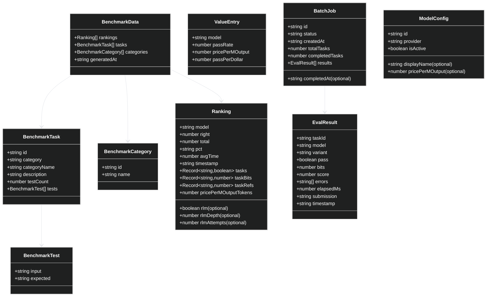

### 1.2 API Contract Domain (`packages/domain/src/Api.ts`)

The HTTP API is defined schema-first using `effect/unstable/httpapi`. Every endpoint, request body, and response is typed via Effect Schema. Auto-generated OpenAPI spec is available at `/openapi.json`.

```mermaid
%%{init: {'theme': 'dark', 'themeVariables': { 
  'background': '#111827',
  'lineColor': '#e5e7eb',
  'primaryTextColor': '#ffffff',
  'secondaryTextColor': '#ffffff',
  'tertiaryTextColor': '#ffffff',
  'primaryBorderColor': '#00f0ff',
  'secondaryBorderColor': '#ff9900',
  'tertiaryBorderColor': '#ff3366',
  'fontSize': '14px'
}}}%%
classDiagram
    class SingleEvalRequest {
        +string model
        +string task
        +string variant (default: "standard")
        +string provider (default: "openrouter")
        +number maxTokens (default: 4096)
        +number rlmMaxDepth (default: 3)
        +string mode (default: "direct")
    }

    class BatchEvalRequest {
        +string[] models
        +string[] tasks (default: [])
        +string variant (default: "both")
        +number concurrency (default: 2)
        +string mode (default: "both")
    }

    class HealthStatus {
        +string status
        +string version
        +string db
        +number uptimeSeconds
    }

    class ModelTestRequest {
        +string provider
        +string model
    }

    class ModelTestResponse {
        +number latencyMs
        +boolean ok
    }

    class HealthGroup {
        +GET /api/health → HealthStatus
    }

    class EvalGroup {
        +POST /api/eval/single → SingleEvalRequest → EvalResult
        +POST /api/eval/batch → BatchEvalRequest → BatchJob
        +GET /api/eval/status/:jobId → BatchJob
    }

    class ResultsGroup {
        +GET /api/results → BenchmarkData
        +GET /api/results/:runId → EvalResult
    }

    class TasksGroup {
        +GET /api/tasks → BenchmarkTask[]
        +GET /api/tasks/:taskId → BenchmarkTask
    }

    class ModelsGroup {
        +GET /api/models → ModelConfig[]
        +POST /api/models/test → ModelTestRequest → ModelTestResponse
    }

    class Api {
        +HealthGroup
        +EvalGroup
        +ResultsGroup
        +TasksGroup
        +ModelsGroup
    }
```

### 1.3 SQLite Persistence Domain (`apps/server/src/services/ResultStore.ts`)

The persistence layer uses `bun:sqlite` with WAL mode. Four tables store all domain data.

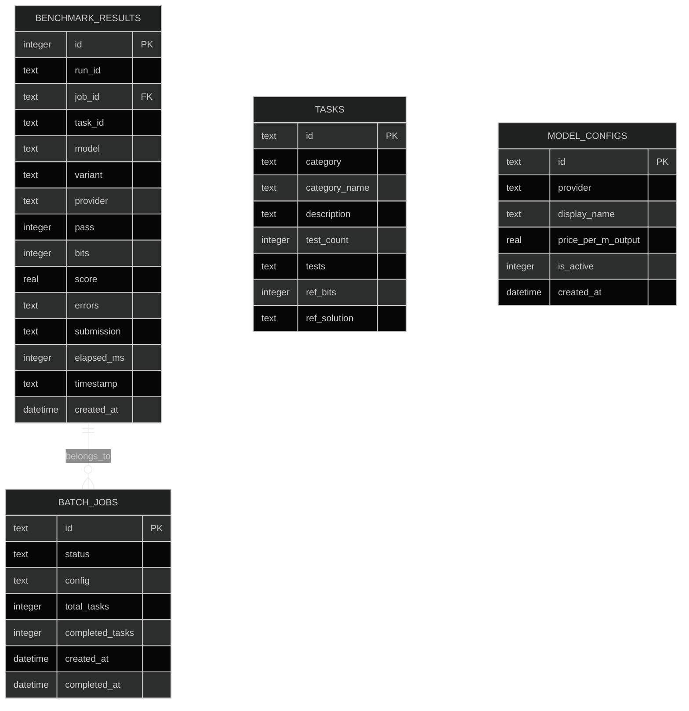

---

## 2. Architecture & Components

### 2.1 System Context

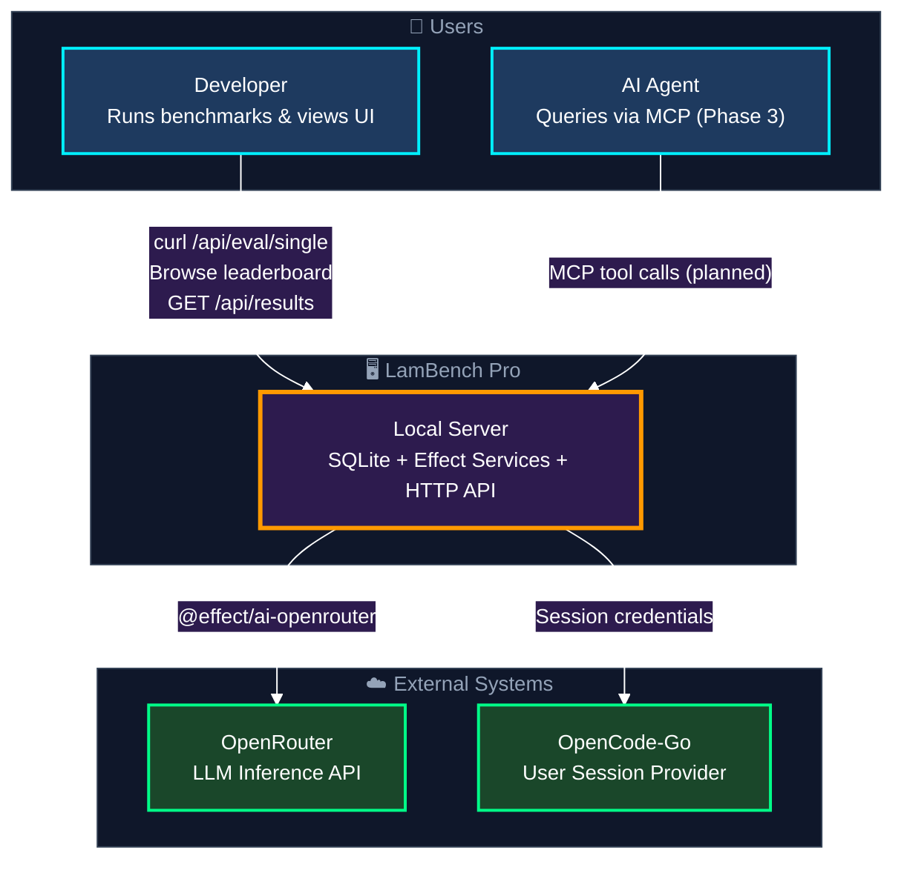

### 2.2 Monorepo Structure

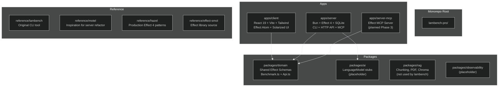

### 2.3 Server Architecture — Effect Service Layers

The server is built entirely with **Effect 4** service pattern (`ServiceMap.Service`, `Layer.effect`, `Effect.fn`). Every external dependency (DB, filesystem, HTTP, LLM) is injected via Layer composition.

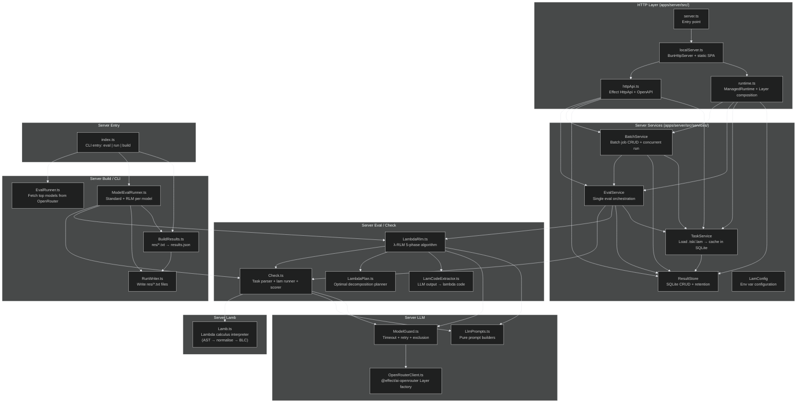

### 2.4 Service Dependency Graph (Layer Composition)

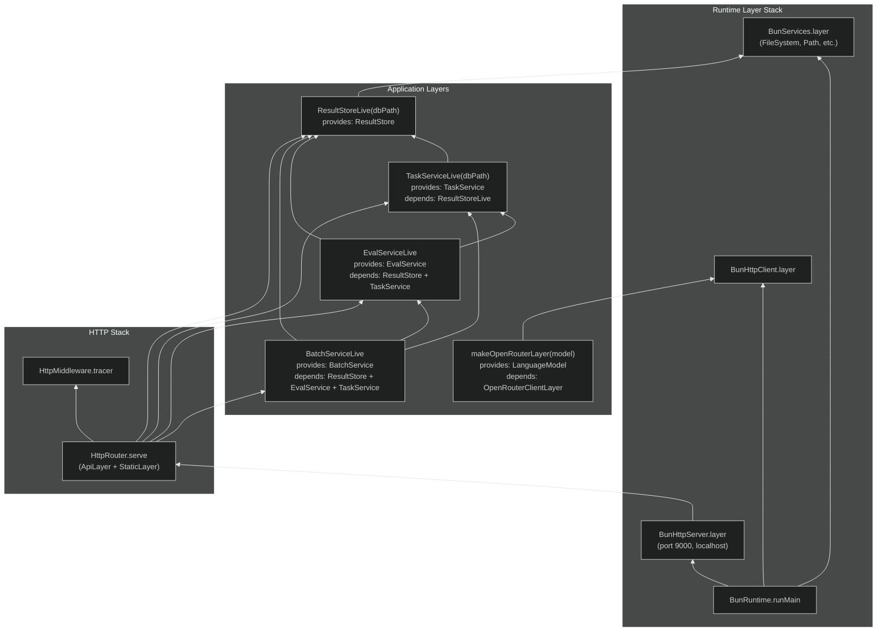

### 2.5 Client Architecture (React + Effect Atom)

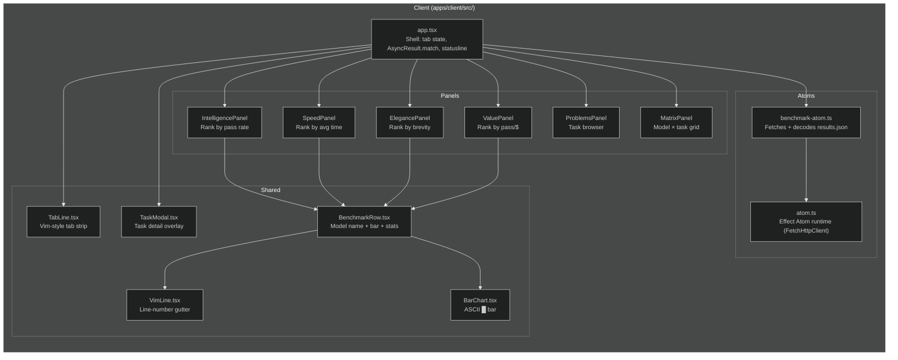

### 2.6 Database Schema (SQLite)

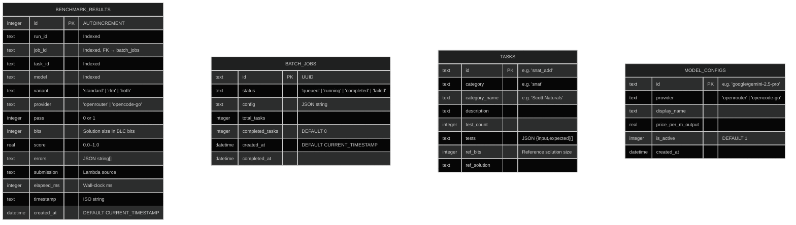

---

## 3. Main Workflows

### 3.1 Single Task Evaluation (Standard)

A single `POST /api/eval/single` request with `variant: "standard"`. One LLM call per task. The `mode` field is accepted in the request but only `"direct"` is fully implemented; `"agent"` mode is planned for Phase 6.

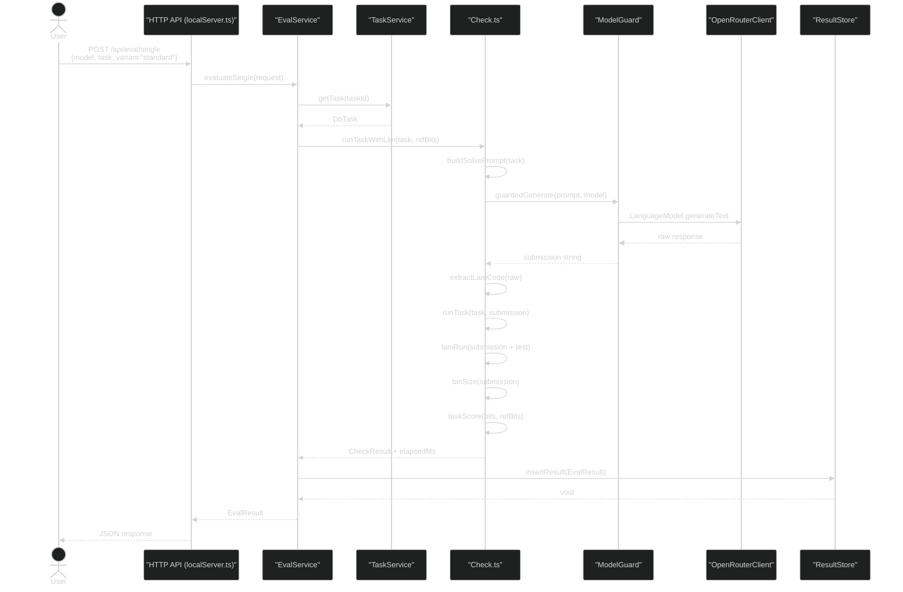

### 3.2 Single Task Evaluation (λ-RLM)

The λ-RLM algorithm runs 5 phases: task detection → planning → Φ execution → self-correction.

```mermaid
%%{init: {'theme': 'dark', 'themeVariables': { 
  'background': '#111827',
  'lineColor': '#e5e7eb',
  'primaryTextColor': '#ffffff',
  'secondaryTextColor': '#ffffff',
  'tertiaryTextColor': '#ffffff',
  'primaryBorderColor': '#00f0ff',
  'secondaryBorderColor': '#ff9900',
  'tertiaryBorderColor': '#ff3366',
  'fontSize': '14px'
}}}%%
sequenceDiagram
    actor User
    participant ES as "EvalService"
    participant LR as "LambdaRlm.ts"
    participant LP as "LambdaPlan.ts"
    participant CH as "Check.ts"
    participant MG as "ModelGuard"
    participant ORC as "OpenRouterClient"

    User->>HTTP: POST /api/eval/single<br/>{variant:"rlm"}
    HTTP->>ES: evaluateSingle(request)
    ES->>LR: rlmEval(task, refBits, config)

    rect rgb(15,35,65)
        Note over LR: Phase 1: context₀ = buildSolvePrompt(task)
    end

    rect rgb(65,45,15)
        Note over LR,ORC: Phase 2: Task Detection (1 LLM call)
        LR->>MG: guardedGenerate(probe, "probe")
        MG->>ORC: generateText
        ORC-->>MG: digit response
        MG-->>LR: taskType string
        LR->>LP: parseTaskType(response)
    end

    rect rgb(15,55,35)
        Note over LR,LP: Phase 3: Optimal Planning (0 LLM calls)
        LR->>LP: plan(taskType, n, contextWindow, α, Aₗ, A⊕)
        LP-->>LR: LambdaPlan {k*, τ*, depth, cost}
    end

    rect rgb(55,55,15)
        Note over LR: Phase 4: Log cost estimate
    end

    rect rgb(55,15,45)
        Note over LR,CH: Phase 5: executeΦ + self-correction
        LR->>LR: effectiveDepth = max(plan.depth, config.maxDepth)
        LR->>CH: leafCall → buildSolvePrompt → guardedGenerate
        CH->>MG: generateText
        MG->>ORC: generateText
        ORC-->>MG: raw
        MG-->>CH: submission
        CH->>CH: runTask → lamRun → binSize
        CH-->>LR: LlmCheckResult

        alt result.pass == false && depthRemaining > 0
            LR->>LR: selfCorrect(state, task, plan, config)
            LR->>CH: buildRetryPrompt(prior, errors)
            CH->>MG: generateText
            MG->>ORC: generateText
            ORC-->>MG: raw
            MG-->>CH: submission
            CH->>CH: runTask
            CH-->>LR: LlmCheckResult
        end
    end

    LR-->>ES: LlmCheckResult {pass, bits, score, attempts, depth}
    ES->>RS: insertResult
```

### 3.3 Batch Evaluation Workflow

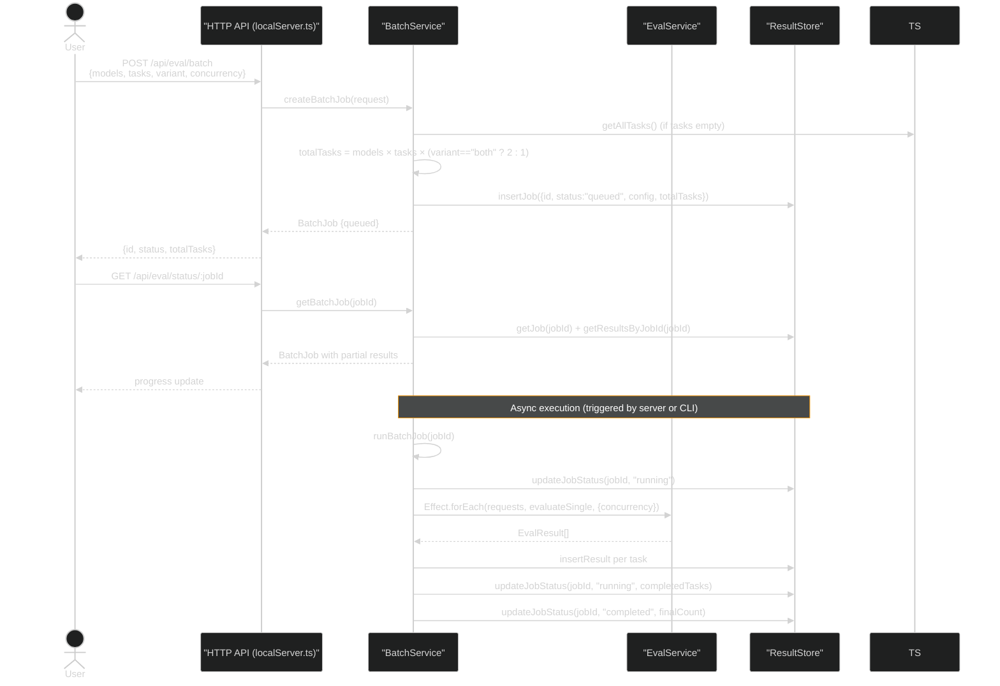

### 3.4 CLI Pipeline Workflow (`bun src/index.ts [eval] [run] [build]`)

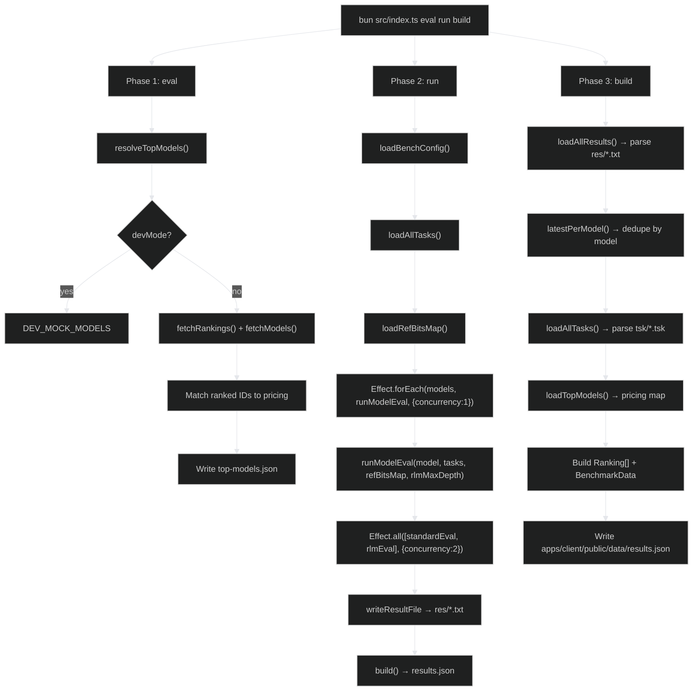

### 3.5 Client Data Flow

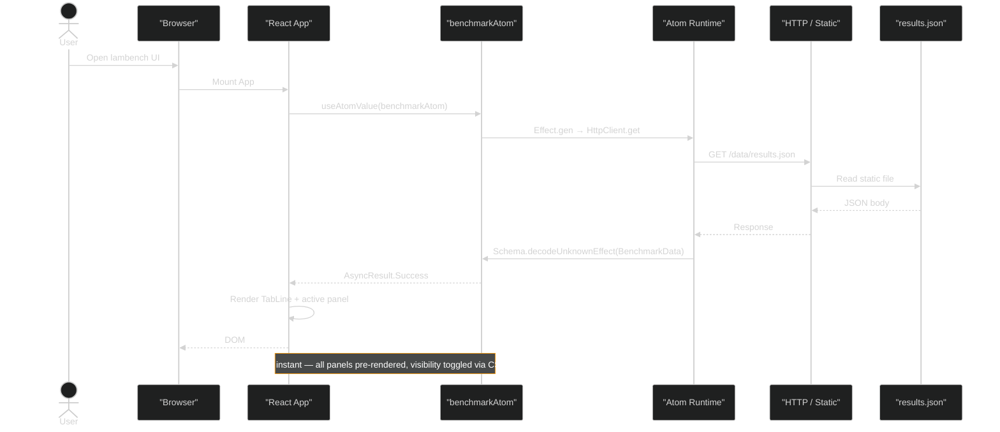

### 3.6 λ-RLM Algorithm Detail (Internal)

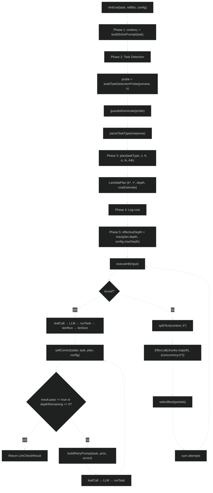

---

## Appendix A: File Map

### Domain (`packages/domain/src/`)
| File | Purpose |
|------|---------|
| `Benchmark.ts` | All shared schemas: Task, Ranking, EvalResult, BatchJob, ModelConfig |
| `Api.ts` | HttpApi groups: Health, Eval, Results, Tasks, Models |

### Server (`apps/server/src/`)
| File | Purpose |
|------|---------|
| `server.ts` | Server entry point — `BunRuntime.runMain(Layer.launch(ServerLive))` |
| `localServer.ts` | BunHttpServer, router, static SPA fallback, middleware |
| `httpApi.ts` | Typed Effect HTTP API with OpenAPI auto-generation (`/openapi.json`) |
| `httpApi.test.ts` | Integration tests for all API endpoints (32 tests) |
| `runtime.ts` | ManagedRuntime with Layer composition and `dbPath` validation |
| `index.ts` | CLI entry point (eval / run / build commands) |
| `services/ResultStore.ts` | SQLite persistence service (CRUD + retention) |
| `services/TaskService.ts` | Load .tsk/.lam files, cache in SQLite |
| `services/EvalService.ts` | Single evaluation orchestration |
| `services/BatchService.ts` | Batch job creation, execution, resumption |
| `services/LamConfig.ts` | Environment variable configuration |
| `check/Check.ts` | Task parser, lam interpreter, scorer, LLM-based runner |
| `lamb/Lamb.ts` | Lambda calculus AST, parser, evaluator, printer, BLC encoder |
| `rlm/LambdaRlm.ts` | λ-RLM 5-phase algorithm |
| `rlm/LambdaPlan.ts` | Optimal decomposition planner (pure math) |
| `rlm/LamCodeExtractor.ts` | Extract lambda code from raw LLM output |
| `llm/OpenRouterClient.ts` | Layer factory for @effect/ai-openrouter |
| `llm/ModelGuard.ts` | Timeout, retry, exclusion logic |
| `llm/LlmPrompts.ts` | Pure prompt builder functions |
| `eval/EvalRunner.ts` | Fetch top models from OpenRouter |
| `eval/ModelEvalRunner.ts` | Standard + RLM eval per model |
| `build/BuildResults.ts` | Aggregate res/*.txt → results.json |
| `run/RunWriter.ts` | Write eval results to res/*.txt |
| `config/BenchConfig.ts` | Load and validate bench.config.json |

### Client (`apps/client/src/`)
| File | Purpose |
|------|---------|
| `app.tsx` | Shell: tab state, AsyncResult.match, statusline |
| `lib/atoms/benchmark-atom.ts` | Effect Atom that fetches + decodes results.json |
| `lib/atom.ts` | Atom runtime with FetchHttpClient layer |
| `components/leaderboard/*.tsx` | Six panels + VimLine + BarChart + TaskModal |
| `components/theme-toggle.tsx` | Solarized light/dark toggle |
| `main.tsx` | React 19 entry point |

---

*Document generated from codebase analysis. Covers Phase 1 (foundation services), Phase 2 (HTTP API + local server), and planned Phases 3–6 (MCP, provider refactor, web UI refresh, agent mode).*
