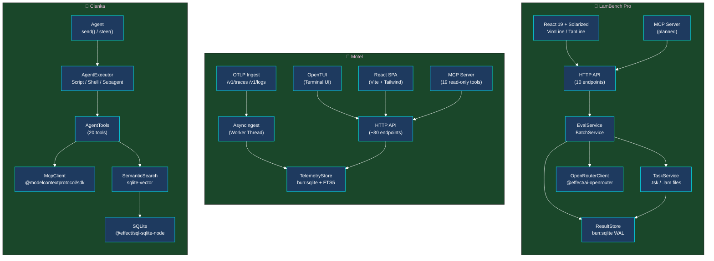
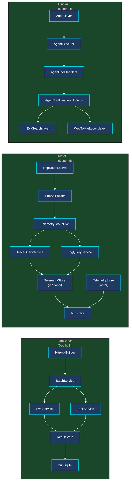
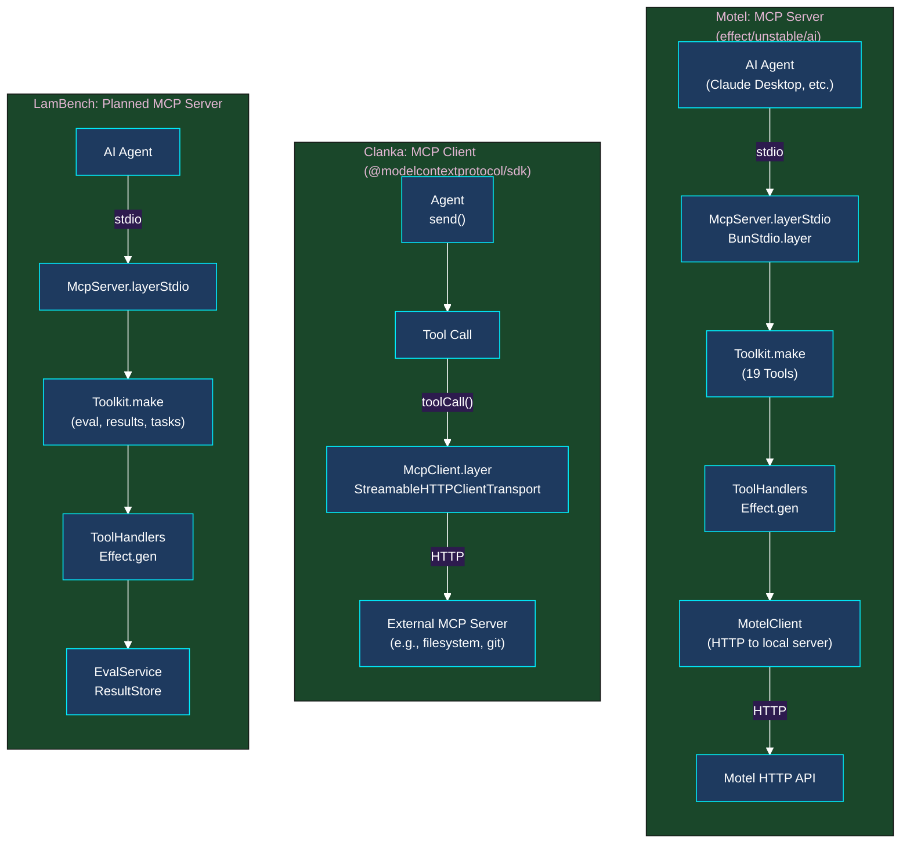
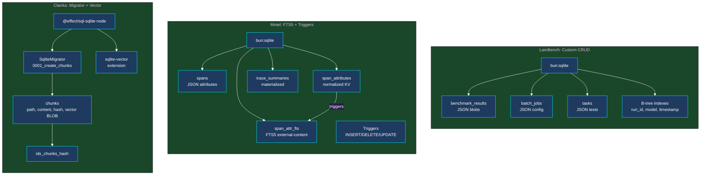

# Comparative Analysis: LamBench Pro, Motel, and Clanka

A deep architectural comparison of three Effect-TS projects with distinct domains, maturity levels, and design philosophies.

---

## 1. Executive Summary

### LamBench Pro

LamBench Pro is a lambda calculus benchmark platform designed to evaluate large language models on formal reasoning tasks. It measures LLM performance across parsing, normalization, and term rewriting challenges encoded in the lambda calculus. The project features a multi-workspace architecture with a Bun-based server (SQLite persistence, Effect services, HTTP API), a React 19 client with a Solarized theme and Vim-inspired UI, and a planned MCP server for agent integration. The codebase is actively evolving, currently building out its service layer and HTTP API atop foundations laid by an SQLite result store and task service.

**Maturity Level**: Mid-stage. Core persistence and evaluation services are implemented; HTTP API and MCP server are under active construction.

### Motel

Motel is a local OpenTelemetry ingest and TUI viewer for development workflows. It accepts OTLP HTTP traces and logs, persists them in SQLite, and exposes rich query endpoints through both a terminal UI (OpenTUI) and a browser-based React SPA. The project is feature-complete and actively maintained, with approximately 30 HTTP endpoints, an MCP server exposing 19 read-only query tools, and a dual-interface design that serves both human developers and AI agents.

**Maturity Level**: Production-ready. Published on npm (`@kitlangton/motel`), with automated CI/CD, comprehensive documentation, and battle-tested patterns for SQLite persistence at scale.

### Clanka

Clanka is an AI agent framework that enables programmable agents to execute JavaScript code, manipulate files, run shell commands, search the web, and delegate tasks to sub-agents. It provides a toolkit-based tool system (20 tools), MCP client integration for external tool calls, and semantic vector search for code discovery. Clanka is purely programmatic and agent-oriented — it has no HTTP server or human-facing UI.

**Maturity Level**: Production-ready. Well-established patterns for agent execution, toolkits, and streaming output via Effect's AI primitives.

---

## 2. Domain Design Comparison

### 2.1 LamBench Domain Model

LamBench models its domain around the benchmark lifecycle, from task definitions through evaluation results to leaderboard rankings.

**Core types** (`packages/domain/src/Benchmark.ts`):

- `BenchmarkTest` — A single test case with `input` (lambda expression) and `expected` (normalized result)
- `BenchmarkTask` — A task definition with category, description, test count, and sample tests
- `BenchmarkCategory` — Taxonomy grouping (`algo`, `cnat`, `cbin`, etc.)
- `Ranking` — Per-model aggregate metrics: pass rate, average time, per-task bits, price-per-dollar
- `EvalResult` — Individual evaluation outcome with pass/fail, solution size in bits, score, errors, elapsed time
- `BatchJob` — Async batch evaluation state machine (`queued` → `running` → `completed`/`failed`)
- `ModelConfig` — Model metadata with provider, pricing, and active flag

Schema patterns in LamBench use `Schema.Struct` with `Schema.Literals` for discriminated unions, `Schema.optional` for nullable fields, and `Schema.withDecodingDefaultKey` for request payloads that carry defaults. Types are exported using the `Schema.Schema.Type<typeof X>` convention.

```typescript
export const EvalResult = Schema.Struct({
  taskId: Schema.String,
  model: Schema.String,
  variant: Schema.Literals(["standard", "rlm", "both"]),
  pass: Schema.Boolean,
  bits: Schema.Number,
  score: Schema.Number,
  errors: Schema.Array(Schema.String),
  elapsedMs: Schema.Number,
  submission: Schema.String,
  timestamp: Schema.String,
});
```

The domain model is relatively flat — no deeply nested structures beyond the `tests` array inside `BenchmarkTask`. Immutability is enforced through `ReadonlyArray` and readonly property modifiers on TypeScript interfaces, though the Schema definitions themselves do not explicitly freeze objects.

### 2.2 Motel Domain Model

Motel's domain centers on OpenTelemetry observability data: traces, spans, logs, and AI call summaries.

**Core types** (`reference/motel/src/domain.ts`):

- `TraceSpanItem` — Individual span with `spanId`, `parentSpanId`, `serviceName`, `operationName`, timing, status, depth, tags, events, and warnings
- `TraceItem` — Full trace tree with root span metadata, span count, error count, and ordered spans
- `LogItem` — Log record with severity, body, trace/span correlation, and merged attributes
- `AiCallSummary` / `AiCallDetail` — Normalized AI SDK call metadata with token usage, timing, previews, and tool calls
- `FacetItem` / `StatsItem` — Query result aggregates for faceted search and grouped statistics

Motel's schema definitions are significantly richer in metadata:

```typescript
export const TraceSpanItem = Schema.Struct({
  spanId: Schema.String,
  parentSpanId: Schema.NullOr(Schema.String),
  serviceName: Schema.String,
  scopeName: Schema.NullOr(Schema.String).pipe(
    Schema.annotateKey({
      description: "Instrumentation scope (e.g. module or library name)",
    }),
  ),
  operationName: Schema.String.pipe(Schema.annotateKey({ description: "The operation this span represents" })),
  startTime: DateFromString.pipe(Schema.annotateKey({ description: "ISO 8601 timestamp" })),
  isRunning: Schema.Boolean.pipe(
    Schema.annotateKey({
      description: "True when the span has not reported an end timestamp yet",
    }),
  ),
  durationMs: Schema.Number.pipe(Schema.annotateKey({ description: "Wall-clock duration in milliseconds" })),
  status: TraceSpanStatus.pipe(Schema.annotateKey({ description: "ok or error" })),
  depth: Schema.Number.pipe(
    Schema.annotateKey({
      description: "Nesting depth in the span tree (root = 0)",
    }),
  ),
  tags: StringRecord.pipe(Schema.annotateKey({ description: "Span attributes as key-value pairs" })),
  warnings: Schema.Array(Schema.String).pipe(
    Schema.annotateKey({
      description: "Structural warnings (e.g. missing parent span)",
    }),
  ),
  events: Schema.Array(TraceSpanEvent),
}).annotate({ identifier: "TraceSpan" });
```

Key differentiators: extensive use of `Schema.annotateKey` and `Schema.annotate` for OpenAPI documentation, `Schema.NullOr` for nullable fields, `Schema.DateFromString` for temporal types, and `Schema.Literals` for enumerations. Every exported schema carries an `.annotate({ identifier: "..." })` call, which feeds directly into the generated OpenAPI specification.

### 2.3 Clanka Domain Model

Clanka's domain is organized around agent execution, tool definitions, and streaming output.

**Core types** (`reference/clanka/src/AgentOutput.ts`, `reference/clanka/src/AgentTools.ts`):

- `Agent` — Service interface exposing `send(prompt)` and `steer(message)`; history managed via `MutableRef<Prompt>`
- `AgentOutput` variants — Tagged union of streaming parts: `AgentStart`, `ReasoningStart`, `ReasoningDelta`, `ScriptStart`, `ScriptDelta`, `ScriptEnd`, `ScriptOutput`, `Usage`, `ErrorRetry`, `SubagentStart`, `SubagentComplete`, `SubagentPart`
- `AgentFinished` — Tagged error class signaling task completion
- `AgentTools` / `AgentToolsWithSearch` — Toolkit definitions using `effect/unstable/ai/Toolkit`
- `McpClient` — Service for connecting to external MCP servers via HTTP transport

Clanka makes heavy use of `Schema.TaggedClass` and `Schema.TaggedErrorClass` for discriminated unions:

```typescript
export class AgentStart extends Schema.TaggedClass<AgentStart>()("AgentStart", {
  id: Schema.Number,
  prompt: Prompt.Prompt,
  provider: Schema.String,
  model: Schema.String,
}) {
  get modelAndProvider() {
    return `${this.provider}/${this.model}`;
  }
}

export class AgentFinished extends Schema.TaggedErrorClass<AgentFinished>()("AgentFinished", {
  summary: Schema.String,
}) {}
```

The `AgentOutput` union composes 11 distinct tagged classes into a single `Schema.Union`, enabling pattern matching across the entire output stream. Tool parameters use `Schema.Struct` with `.annotate({ documentation: "..." })` for tool descriptions consumed by LLMs.

### 2.4 Domain Comparison Table

| Dimension                   | LamBench Pro                                                                        | Motel                                                                              | Clanka                                                                                           |
| --------------------------- | ----------------------------------------------------------------------------------- | ---------------------------------------------------------------------------------- | ------------------------------------------------------------------------------------------------ |
| **Schema Richness**         | Moderate — core fields with basic validation                                        | Very High — every field annotated for OpenAPI, descriptions on all query params    | High — tagged unions with computed properties, tool schemas with documentation                   |
| **Nesting Depth**           | Shallow (2–3 levels: Task → Tests → Test)                                           | Deep (Trace → Spans → Events; AI Call → Tool Calls → Usage → Timing)               | Moderate (Agent → Output Stream → Tagged Parts)                                                  |
| **Effect Schema Features**  | `Struct`, `Array`, `Literal`, `optional`, `withDecodingDefaultKey`                  | `Struct`, `NullOr`, `annotateKey`, `annotate`, `DateFromString`, `Record`, `Array` | `TaggedClass`, `TaggedErrorClass`, `Struct`, `Void`, `Union`, `Opaque`                           |
| **Immutability Guarantees** | `ReadonlyArray`, `readonly` properties on interfaces; Schema itself does not freeze | `readonly` on all interface properties; immutable query result arrays              | Heavy use of `Data.TaggedClass` for immutable tagged unions; `MutableRef` only for agent history |
| **Type Export Style**       | `export type X = Schema.Schema.Type<typeof X>`                                      | `export type X = typeof X.Type`                                                    | Inline type inference from Schema; explicit `TypeId` branded interfaces                          |
| **Documentation Density**   | Low — minimal JSDoc on schemas                                                      | Very High — every field has `annotateKey` description                              | Moderate — JSDoc `@since` and `@category` tags; tool descriptions in schema annotations          |

### 2.5 Key Observations

- **Motel's schema annotations are not merely decorative** — they drive the OpenAPI generator and the MCP tool descriptions. This creates a single source of truth where the same `annotateKey` calls appear in both the HTTP API spec and the AI-facing tool definitions.
- **Clanka's tagged union pattern** (`Schema.TaggedClass`) is the most sophisticated error/event modeling of the three. The `AgentFinished` error class elegantly signals completion through the error channel, allowing normal success to represent partial output.
- **LamBench's domain is the simplest** in structure but carries complex derived metrics (bits, score, pass rate). The `Ranking` type's `taskBits` and `taskRefs` records enable per-task granularity without nested arrays.

---

## 3. Service Architecture Comparison

### 3.1 LamBench Service Layer

LamBench defines services using `Context.Service` (the stable Effect 4 pattern):

```typescript
export class ResultStore extends Context.Service<
  ResultStore,
  {
    insertResult(result: InsertResult): Effect.Effect<void, SqlError>;
    getResultsByRunId(runId: string): Effect.Effect<ReadonlyArray<DbResult>, SqlError>;
    // ... 18 additional methods
  }
>()("app/ResultStore") {}
```

Services are instantiated via `Layer.effect` factories that close over `bun:sqlite` connections. The `ResultStoreLive` factory accepts a `dbPath: string` and returns a `Layer.Layer<ResultStore>`. Internal helpers use `Effect.fnUntraced`; exported service methods use `Effect.fn` with trace names.

**Key services** (`apps/server/src/services/`):

- `ResultStore` — SQLite CRUD for results, jobs, tasks, model configs
- `TaskService` — Loads `.tsk`/`.lam` files from disk, caches in SQLite
- `EvalService` — Single evaluation orchestrator (standard or λ-RLM variant)
- `BatchService` — Batch job creation, execution, and resumption

Error handling uses a simple `SqlError` class with `_tag` discriminator:

```typescript
export class SqlError {
  readonly _tag = "SqlError" as const;
  constructor(readonly message: string) {}
}
```

Service composition is explicit — `BatchServiceLive` depends on `ResultStore`, `EvalService`, and `TaskService`, which in turn depends on `ResultStore`. There is no managed runtime yet; layers are composed ad-hoc in `httpApi.ts` via `Layer.provide` chaining.

### 3.2 Motel Service Layer

Motel uses `Context.Service` (the stable Effect 4 pattern, distinct from `ServiceMap.Service`):

```typescript
export class TelemetryStore extends Context.Service<
  TelemetryStore,
  {
    readonly ingestTraces: (
      payload: OtlpTraceExportRequest,
    ) => Effect.Effect<{ readonly insertedSpans: number }, Error>;
    readonly searchTraces: (input: TraceSearch) => Effect.Effect<readonly TraceItem[], Error>;
    // ... 20+ additional methods
  }
>()("motel/TelemetryStore") {}
```

Motel distinguishes between **writer** and **readonly** connections through `TelemetryStoreOptions`, preventing lock contention between the daemon (writer) and TUI (reader):

```typescript
export interface TelemetryStoreOptions {
  readonly readonly: boolean;
  readonly runRetention: boolean;
}

export const TelemetryStoreLive = makeTelemetryStoreLayer({
  readonly: false,
  runRetention: true,
});
export const TelemetryStoreReadonlyLive = makeTelemetryStoreLayer({
  readonly: true,
  runRetention: false,
});
```

**Key services** (`reference/motel/src/services/`):

- `TelemetryStore` — SQLite persistence with FTS5, triggers, retention
- `TraceQueryService` — Read-only trace queries (consumer of `TelemetryStoreReadonlyLive`)
- `LogQueryService` — Read-only log queries
- `AsyncIngest` — Worker-thread OTLP ingest to keep the main event loop free

Resource management is sophisticated. The `TelemetryStore` layer uses `Effect.acquireRelease` to open the SQLite connection and run `PRAGMA optimize` on close. Background retention runs via `Effect.forkScoped(Effect.repeat(cleanupExpired, Schedule.spaced("60 seconds")))`.

The runtime (`reference/motel/src/runtime.ts`) composes these into a `ManagedRuntime`:

```typescript
const QueryServicesLive = Layer.mergeAll(TraceQueryServiceLive, LogQueryServiceLive).pipe(
  Layer.provideMerge(TelemetryStoreReadonlyLive),
);

export const queryRuntime = ManagedRuntime.make(QueryRuntimeLive);
export const storeRuntime = ManagedRuntime.make(TelemetryStoreLive);
```

### 3.3 Clanka Service Layer

Clanka uses both `Context.Service` and `Context.Reference` for different lifecycle patterns:

```typescript
export const Agent = Context.Service<Agent>("clanka/Agent");

export class ConversationMode extends Context.Reference<boolean>("clanka/Agent/ConversationMode", {
  defaultValue: () => false,
}) {
  static readonly layer = (enabled: boolean) => Layer.succeed(ConversationMode, enabled);
}
```

`Context.Reference` provides default values without requiring layer provision, useful for configuration flags. `Context.Service` requires explicit layer construction.

**Key services** (`reference/clanka/src/`):

- `Agent` — Main agent service with streaming `send()` and `steer()`
- `AgentExecutor` — Script execution environment (file system, shell, subagents)
- `AgentTools` / `AgentToolsWithSearch` — Toolkit definitions (20 tools)
- `McpClient` — MCP client over HTTP transport
- `SemanticSearch` — Vector search service (optional, graceful degradation)

Clanka's `AgentTools` uses `Toolkit.make` and `Tool.make` from `effect/unstable/ai`:

```typescript
export const AgentTools = Toolkit.make(
  Tool.make("readFile", {
    description: "Read a file and optionally filter the lines to return.",
    parameters: Schema.Struct({
      path: Schema.String,
      startLine: Schema.optional(Schema.Number),
    }),
    success: Schema.NullOr(Schema.String),
    dependencies: [CurrentDirectory],
  }),
  // ... 19 additional tools
);
```

Layer composition chains tool handlers through `Layer.provide`:

```typescript
export const AgentToolHandlers = AgentToolHandlersNoDeps.pipe(Layer.provide([ExaSearch.layer, WebToMarkdown.layer]));
```

### 3.4 Service Architecture Comparison Table

| Dimension               | LamBench Pro                                                                     | Motel                                                                                                                        | Clanka                                                                                                           |
| ----------------------- | -------------------------------------------------------------------------------- | ---------------------------------------------------------------------------------------------------------------------------- | ---------------------------------------------------------------------------------------------------------------- |
| **Service Definition**  | `Context.Service` (stable pattern)                                               | `Context.Service` (stable pattern)                                                                                           | `Context.Service` + `Context.Reference`                                                                          |
| **Layer Factory Style** | Factory functions accepting config (`dbPath`, `model`)                           | Pre-configured layers + options objects (`TelemetryStoreOptions`)                                                            | Direct `Layer.effect` with `Effect.gen`                                                                          |
| **Layer Depth**         | Shallow (2–3 levels: `BatchServiceLive` → `EvalServiceLive` → `ResultStoreLive`) | Deep (4–5 levels: `ServerLive` → `ApiLayer` → `TelemetryGroupLive` → `TraceQueryServiceLive` → `TelemetryStoreReadonlyLive`) | Moderate (3–4 levels: `AgentToolHandlers` → `AgentToolHandlersNoDeps` → `ExaSearch.layer`)                       |
| **DI Pattern**          | Ad-hoc `Layer.provide` in HTTP handlers and `BatchService`                       | `ManagedRuntime` with separate `queryRuntime` and `storeRuntime`                                                             | `Layer.provide` in constructors; `Effect.provideService` for subagent model injection                            |
| **Error Handling**      | Simple `SqlError` class with `_tag`; no union types                              | Typed `Error` channel; service methods return `Effect<A, Error>`                                                             | `Schema.TaggedErrorClass` for `AgentFinished`; `AiError.AiError` for LLM failures; `Effect.die` for fatal errors |
| **Resource Management** | Basic — `mkdirSync` + `new Database` inside `Layer.effect`                       | Sophisticated — `Effect.acquireRelease` for DB connections, `Effect.forkScoped` for background retention, incremental vacuum | `Effect.acquireRelease` for `McpClient` connection; `Effect.scoped` for child process execution                  |

### 3.5 Key Observations

- **All three projects now use `Context.Service`** — LamBench completed its migration from `ServiceMap.Service`, aligning with the stable Effect 4 pattern used by Motel and Clanka.
- **Motel's readonly/writer split** is a critical pattern for SQLite concurrency. LamBench could adopt this if it ever serves reads and writes from different processes.
- **Clanka's `Context.Reference`** is a lightweight alternative to full services for configuration. LamBench could use this for `BenchConfig` instead of passing config through layer factories.
- **Motel's `ManagedRuntime`** provides a clean boundary between service construction and execution. LamBench currently lacks this, composing layers inline in HTTP handlers.

---

## 4. Persistence & Storage Comparison

### 4.1 LamBench: bun:sqlite with Custom CRUD

LamBench uses `bun:sqlite` directly with WAL mode and hand-written SQL:

```typescript
const db = new Database(dbPath, { create: true });
db.exec("PRAGMA journal_mode = WAL");
db.exec("PRAGMA foreign_keys = ON");
db.exec(CREATE_TABLES_SQL);
```

Tables (`apps/server/src/services/ResultStore.ts`):

- `benchmark_results` — Individual evaluation results with run/job/task/model keys
- `batch_jobs` — Job state machine with JSON config blob
- `tasks` — Cached task definitions with JSON tests blob
- `model_configs` — Active model registry

Indexes: B-tree indexes on `run_id`, `job_id`, `task_id`, `model`, `timestamp`, `created_at`, and composite `(pass, created_at)`. No FTS, no triggers, no attribute decomposition.

Retention strategy: Time-based deletion of old results and completed jobs, plus size-based pruning of oldest 20% of passing results when DB exceeds max size. WAL checkpoint with `TRUNCATE` after cleanup.

Schema migration: None. Tables use `CREATE TABLE IF NOT EXISTS` and `CREATE INDEX IF NOT EXISTS`. No ALTER TABLE migrations.

### 4.2 Motel: bun:sqlite with FTS5, Triggers, and Advanced Retention

Motel's `TelemetryStore` (`reference/motel/src/services/TelemetryStore.ts`) is the most sophisticated SQLite layer of the three projects.

**Tables**:

- `spans` — OTel spans with JSON attribute/resource/event blobs
- `logs` — Log records with severity, body, timestamp
- `trace_summaries` — Materialized aggregates (duration, span count, error count, active span count)
- `span_attributes` — Normalized key-value pairs from span tags (enables indexed attribute queries)
- `log_attributes` — Normalized key-value pairs from log tags

**FTS5 virtual tables**:

- `span_operation_fts` — Full-text search on operation names
- `log_body_fts` — Full-text search on log bodies
- `span_attr_fts` — External-content FTS5 over LLM content attributes (`AI_FTS_KEYS`)

**Triggers**:

```sql
CREATE TRIGGER IF NOT EXISTS span_attr_fts_ai AFTER INSERT ON span_attributes
WHEN new.key IN ('ai.prompt', 'ai.prompt.messages', /* ... 18 more keys */)
BEGIN
  INSERT INTO span_attr_fts(rowid, value) VALUES (new.rowid, new.value);
END;
```

Motel uses three triggers on the `span_attr_fts` external-content FTS table (insert, delete, update) to keep the inverted index synchronized with the normalized attribute table.

**Schema migration strategy**: Runtime ALTER TABLE with try/catch for additive changes:

```typescript
try {
  db.exec(`ALTER TABLE trace_summaries ADD COLUMN active_span_count INTEGER NOT NULL DEFAULT 0`);
} catch {
  // Existing databases may already have the column.
}
```

**Retention**: Trace-granular eviction (never leaves half-gutted traces), time-based cutoff, size-based pruning of oldest 20% completed traces, orphan log cleanup, WAL checkpoint (PASSIVE), incremental vacuum (2000 pages per pass), and periodic `PRAGMA optimize`.

**Query optimization**: 64MB cache, 256MB mmap, `PRAGMA analysis_limit = 1000`, forced `ANALYZE` on first open, busy timeout 15s.

### 4.3 Clanka: @effect/sql-sqlite-node with Migrator and Vector Extension

Clanka uses the official Effect SQL package rather than raw `bun:sqlite`:

```typescript
export const SqliteLayer = (database: string) =>
  SqliteMigrator.layer({
    loader: SqliteMigrator.fromRecord({
      "0001_create_chunks": Effect.gen(function* () {
        const sql = yield* SqlClient.SqlClient;
        yield* sql`CREATE TABLE IF NOT EXISTS chunks (
          id INTEGER PRIMARY KEY AUTOINCREMENT,
          path TEXT NOT NULL,
          content TEXT NOT NULL,
          hash TEXT NOT NULL,
          vector BLOB NOT NULL,
          syncId TEXT NOT NULL
        )`;
        yield* sql`CREATE INDEX IF NOT EXISTS idx_chunks_hash ON chunks (hash)`;
      }),
    }),
  }).pipe(
    Layer.provide(
      Layer.effectDiscard(
        Effect.gen(function* () {
          const client = yield* SqliteClient.SqliteClient;
          yield* client.loadExtension(getExtensionPath());
        }),
      ),
    ),
    Layer.provideMerge(SqliteClient.layer({ filename: database })),
  );
```

Key characteristics:

- **Named migrations**: `0001_create_chunks` with `SqliteMigrator.fromRecord`
- **Vector extension**: Loads `sqlite-vector` via `loadExtension` for semantic search
- **Template literal SQL**: `yield* sql`CREATE TABLE ...`` — type-safe but runtime-validated
- **No FTS**: Search is semantic (vector similarity) rather than lexical

### 4.4 Persistence Comparison Table

| Dimension                      | LamBench Pro                               | Motel                                                                                         | Clanka                                            |
| ------------------------------ | ------------------------------------------ | --------------------------------------------------------------------------------------------- | ------------------------------------------------- |
| **SQLite Driver**              | `bun:sqlite` (raw)                         | `bun:sqlite` (raw)                                                                            | `@effect/sql-sqlite-node`                         |
| **WAL Mode**                   | Yes (`PRAGMA journal_mode = WAL`)          | Yes + `wal_autocheckpoint = 4000` + passive checkpoint                                        | Not explicitly configured                         |
| **Schema Migration**           | None — `IF NOT EXISTS` only                | Runtime `ALTER TABLE` with try/catch for additive changes                                     | `SqliteMigrator` with named versioned migrations  |
| **Indexing**                   | B-tree on foreign keys and timestamps      | B-tree + composite indexes on all query dimensions                                            | Single index on `hash`                            |
| **FTS**                        | None                                       | FTS5 with external-content tables, unicode61 tokenization, 3 trigger types per table          | None                                              |
| **Vector Search**              | None                                       | None                                                                                          | Yes — `sqlite-vector` extension with BLOB vectors |
| **Attribute Decomposition**    | None — JSON blobs only                     | Normalized `span_attributes` / `log_attributes` tables with exact-match and substring indexes | None — single `chunks` table                      |
| **Retention**                  | Time-based + size-based pruning of results | Trace-granular eviction, incremental vacuum, orphan cleanup                                   | Not implemented                                   |
| **Query Planner Optimization** | None                                       | `PRAGMA optimize`, `ANALYZE`, `analysis_limit = 1000`                                         | None                                              |
| **Readonly Connections**       | Not supported                              | First-class support via `TelemetryStoreOptions.readonly`                                      | Not applicable                                    |

### 4.5 Key Observations

- **Motel's attribute decomposition** (`span_attributes` table) is essential for its faceted search and AI call filtering. LamBench currently stores all task/test data as JSON blobs, which prevents indexed queries on individual test attributes.
- **Motel's FTS5 integration** turns 500–800ms LIKE scans into <50ms MATCH queries. If LamBench needs to search submission text or error messages, FTS5 is the proven pattern.
- **Clanka's `SqliteMigrator`** provides a cleaner migration story than Motel's try/catch ALTER TABLE or LamBench's `IF NOT EXISTS`. For LamBench, adopting `SqliteMigrator` would enable safe schema evolution as the project grows.

---

## 5. HTTP API & Communication Comparison

### 5.1 LamBench HTTP API

LamBench defines its API in `packages/domain/src/Api.ts` using `effect/unstable/httpapi`:

```typescript
export class HealthGroup extends HttpApiGroup.make("health")
  .add(HttpApiEndpoint.get("get", "/health", { success: HealthStatus }))
  .prefix("/api") {}

export class EvalGroup extends HttpApiGroup.make("eval")
  .add(
    HttpApiEndpoint.post("single", "/eval/single", {
      success: EvalResult,
      payload: SingleEvalRequest,
    }),
  )
  .add(
    HttpApiEndpoint.post("batch", "/eval/batch", {
      success: BatchJob,
      payload: BatchEvalRequest,
    }),
  )
  .add(
    HttpApiEndpoint.get("status", "/eval/status/:jobId", {
      success: BatchJob,
      params: Schema.Struct({ jobId: Schema.String }),
    }),
  )
  .prefix("/api") {}

export const Api = HttpApi.make("Api")
  .add(HealthGroup)
  .add(EvalGroup)
  .add(ResultsGroup)
  .add(TasksGroup)
  .add(ModelsGroup);
```

The implementation in `apps/server/src/httpApi.ts` uses `HttpApiBuilder.group` to wire handlers:

```typescript
const EvalGroupLive = HttpApiBuilder.group(Api, "eval", (handlers) =>
  handlers
    .handle("single", ({ payload }) =>
      Effect.gen(function* () {
        const evalService = yield* EvalService;
        return yield* evalService.evaluateSingle(payload);
      }).pipe(Effect.match({ onFailure: ..., onSuccess: ... })),
    )
    .handle("batch", ...)
    .handle("status", ...),
);
```

**Endpoint count**: 10 (2 health, 3 eval, 2 results, 2 tasks, 2 models).

**OpenAPI**: Auto-generated at `/openapi.json` via `HttpApiBuilder.layer(Api, { openapiPath: "/openapi.json" })`. Basic annotations can be added per-endpoint as the API matures.

**Error handling**: All handlers wrap in `Effect.match` returning `HttpServerResponse.jsonUnsafe` with 500/404 status codes. No typed error schemas.

### 5.2 Motel HTTP API

Motel's API (`reference/motel/src/httpApi.ts`) is significantly more mature:

```typescript
export const MotelHttpApi = HttpApi.make("MotelTelemetry")
  .annotate(OpenApi.Title, "Motel Telemetry API")
  .annotate(OpenApi.Version, "1.0.0")
  .annotate(OpenApi.Description, "Local OpenTelemetry ingest, query, and debugging API...")
  .add(
    HttpApiGroup.make("telemetry")
      .annotate(OpenApi.Description, "Query traces, spans, logs, and service metadata...")
      .add(
        HttpApiEndpoint.get("health", "/api/health", { success: Health })
          .annotate(OpenApi.Summary, "Health check and identity handshake")
          .annotate(OpenApi.Description, "Returns liveness plus identity fields..."),
        // ... 25+ additional endpoints
      ),
  );
```

**Endpoint count**: ~30 (health, OTLP ingest, services, traces, trace search, trace stats, trace detail, trace spans, trace logs, spans, span search, span detail, span logs, logs, log search, log stats, AI calls, AI call detail, AI stats, facets, docs, OpenAPI).

**OpenAPI**: Fully annotated with titles, descriptions, and parameter documentation. Generated spec exposed at `/openapi.json`.

**Query parameter parsing**: Custom parsers for `lookback` (`15m`, `1h`, `6h`), `limit` (bounded clamping), `cursor` (base64url-encoded pagination), and attribute filters (`attr.key=value`, `attrContains.key=substring`).

**Static SPA serving**: `HttpStaticServer.layer` serves the Vite-built React UI with SPA fallback.

### 5.3 Clanka: No HTTP Server

Clanka has no HTTP server. Communication is entirely programmatic through:

1. **Effect AI toolkit calls** — The agent invokes tools via `LanguageModel.streamText({ toolkit: singleTool })`
2. **MCP client over HTTP** — `McpClient.connect({ url })` uses `@modelcontextprotocol/sdk` with `StreamableHTTPClientTransport`
3. **Stdio** — The CLI reads from stdin and writes to stdout

```typescript
export const McpClient = Context.Service<
  McpClient,
  {
    connect(options: { readonly url: string }): Effect.Effect<void, McpClientError>;
    toolCall(options: {
      readonly name: string;
      readonly arguments: Record<string, unknown>;
    }): Effect.Effect<unknown, McpClientError>;
  }
>()("clanka/McpClient");
```

### 5.4 HTTP API Comparison Table

| Dimension          | LamBench Pro                                                     | Motel                                                                                 | Clanka                                         |
| ------------------ | ---------------------------------------------------------------- | ------------------------------------------------------------------------------------- | ---------------------------------------------- |
| **API Style**      | Effect `HttpApi` groups with `HttpApiBuilder`                    | Effect `HttpApi` with extensive OpenApi annotations                                   | None — programmatic only                       |
| **Endpoint Count** | 10                                                               | ~30                                                                                   | 0                                              |
| **Transport**      | HTTP (BunHttpServer on port 9000)                                | HTTP (BunHttpServer), OTLP HTTP, MCP stdio                                            | MCP over HTTP, stdio, internal Effect channels |
| **OpenAPI**        | Not annotated                                                    | Fully annotated — title, version, descriptions, parameter docs                        | N/A                                            |
| **Query Parsing**  | Path params only                                                 | Custom lookback, limit, cursor, attribute filter parsers                              | N/A                                            |
| **Pagination**     | None                                                             | Cursor-based with base64url encoding, meta object with `nextCursor`                   | N/A                                            |
| **Static Files**   | `HttpStaticServer.layer` with SPA fallback (`../../client/dist`) | `HttpStaticServer.layer` with SPA fallback                                            | N/A                                            |
| **Middleware**     | `HttpMiddleware.tracer` with per-request spans                   | `HttpMiddleware.tracer` with per-request OTel spans; OTLP paths excluded from tracing | N/A                                            |

---

## 6. MCP Integration Comparison

### 6.1 LamBench: MCP Server (Planned)

LamBench does not yet have an MCP server, but the architecture plan includes one. Based on the existing service layer, an MCP server would likely expose tools such as:

- `lambench_eval_single` — Run a single benchmark evaluation
- `lambench_eval_batch` — Queue a batch evaluation job
- `lambench_get_results` — Retrieve latest results/rankings
- `lambench_get_tasks` — List available benchmark tasks
- `lambench_get_task` — Get detail for a specific task
- `lambench_get_models` — List configured models

### 6.2 Motel: MCP Server with 19 Read-Only Tools

Motel's MCP implementation (`reference/motel/src/mcp.ts`) is the most complete of the three. It uses `effect/unstable/ai/McpServer` + `Toolkit`:

```typescript
const StatusTool = Tool.make("motel_status", {
  description: "Check which motel instance this shim is connected to...",
  parameters: Tool.EmptyParams,
  success: Schema.Struct({ connected: Schema.Boolean, ... }),
}).annotate(Tool.Readonly, true);

const SearchTracesTool = Tool.make("motel_search_traces", {
  description: "Search distributed traces by service, operation, error status...",
  parameters: Schema.Struct({ service: ServiceParam, operation: ..., status: ..., ... }),
  success: Schema.Unknown,
}).annotate(Tool.Readonly, true);

const MotelToolkit = Toolkit.make(
  StatusTool, ServicesTool, FacetsTool,
  SearchTracesTool, GetTraceTool, GetTraceLogsTool,
  // ... 12 additional tools
);

const ServerLayer = McpServer.toolkit(MotelToolkit).pipe(
  Layer.provideMerge(ToolHandlers),
  Layer.provide(MotelClientLive),
  Layer.provide(LocatorLive),
  Layer.provide(McpServer.layerStdio({ name: "motel", version: "0.1.0" })),
  Layer.provide(BunStdio.layer),
);
```

All tools are annotated with `Tool.Readonly`, signaling to clients that no mutations occur. The server communicates over stdio (`McpServer.layerStdio`), which is the standard MCP transport for local tool servers.

### 6.3 Clanka: MCP Client

Clanka acts as an MCP **client**, not a server. It connects to external MCP servers via HTTP:

```typescript
export const layer = Layer.effect(
  McpClient,
  Effect.gen(function* () {
    const client = yield* Effect.acquireRelease(
      Effect.sync(() => new Client({ name: "clanka", version: "0.1.0" })),
      (client) => Effect.promise(() => client.close()),
    );

    const connect = Effect.fn("McpClient.connect")(function* (options: { readonly url: string }) {
      const transport = new StreamableHTTPClientTransport(new URL(options.url));
      return yield* Effect.tryPromise({
        try: (signal) => client.connect(transport as Transport, { signal }),
        catch: (cause) => new McpClientError({ cause }),
      });
    });

    return McpClient.of({
      connect,
      toolCall: Effect.fn("McpClient.toolCall")((options) =>
        Effect.tryPromise({
          try: async () => {
            const response = await client.callTool({
              name: options.name,
              arguments: options.arguments,
            });
            return response.structuredContent ?? response.content;
          },
          catch: (cause) => new McpClientError({ cause }),
        }),
      ),
    });
  }),
);
```

This enables Clanka agents to leverage external tools exposed by other MCP-compatible servers.

### 6.4 MCP/CLI Interface Evaluation

**Effect CLI vs MCP/curl for Benchmark Interfaces**:

| Aspect                         | Effect CLI                                                                     | MCP Server                                                                          |
| ------------------------------ | ------------------------------------------------------------------------------ | ----------------------------------------------------------------------------------- |
| **Type Safety**                | Excellent — full Effect type checking, schema validation, typed error channels | Good — MCP protocol is typed, but clients may not enforce schemas                   |
| **Ecosystem Integration**      | Native Effect — composes with services, layers, and runtime                    | Universal — any MCP client (Claude Desktop, IDE plugins, custom agents) can connect |
| **Human Developer Experience** | Familiar command-line interface, shell completion, help text                   | Requires MCP client; less direct for ad-hoc human use                               |
| **Agent Integration**          | Requires custom wrapper to expose as tools                                     | Native — agents discover and invoke tools automatically                             |
| **Language Agnostic**          | No — Effect/TypeScript only                                                    | Yes — MCP is protocol-based                                                         |
| **Complexity**                 | Low — direct service calls                                                     | Medium — requires MCP server lifecycle, stdio transport, tool schema definitions    |
| **Observability**              | Built into Effect (spans, logs)                                                | Depends on MCP client implementation                                                |

**Recommendation**: For a benchmark platform like LamBench Pro that needs to serve both human developers and AI agents, the optimal strategy is to provide **both interfaces**:

1. **Effect CLI** (`bun src/index.ts eval`, `bun src/index.ts run`, `bun src/index.ts build`) for developers who want type-safe, scriptable benchmark execution integrated into their workflows.
2. **MCP Server** for agent integration — an AI coding assistant can discover `lambench_eval_single`, invoke it with a model name and task ID, and receive structured results without custom integration code.

The MCP server should expose the same underlying services (`EvalService`, `BatchService`, `ResultStore`) through a `Toolkit` definition, following Motel's pattern of annotating all tools with `Tool.Readonly` since benchmark execution is conceptually a read-only query against model capability.

---

## 7. UI & Frontend Comparison

### 7.1 LamBench: React 19 + Solarized Theme + Vim Aesthetic

LamBench's client (`apps/client/`) is a React 19 application built with Vite 8 and Tailwind CSS 4. It uses `@effect/atom-react` for state management and follows a distinctive Solarized color scheme with Vim-inspired UI components.

**Key UI components**:

- `TabLine.tsx` — Vim-style tab strip centered at the top, with mode indicators
- `VimLine.tsx` — Content rows with 4-character line-number gutter
- `BarChart.tsx` — ASCII block bar charts using the `█` glyph with gradient coloring
- `IntelligencePanel` — Rankings by pass rate
- `SpeedPanel` — Rankings by average response time
- `ElegancePanel` — Rankings by solution brevity (bits)
- `ValuePanel` — Rankings by pass rate per dollar
- `ProblemsPanel` — Task browser with category filter
- `MatrixPanel` — Model × task pass/fail grid
- `TaskModal` — Task detail overlay with test cases

**State management**: Effect Atoms with `AsyncResult.match` for loading/error/success states:

```typescript
const result = useAtomValue(benchmarkAtom);
return AsyncResult.match(result, {
  onInitial: () => <LoadingView />,
  onFailure: (e) => <ErrorView message={...} />,
  onSuccess: (s) => <AppLayout data={s.value} />,
});
```

**Styling**: CSS variables for Solarized tokens (`--sol-base3`, `--sol-green`, `--sol-blue`), JetBrains Mono Variable font, `cn()` utility for dynamic class merging.

**Deployment**: Static build deployed to GitHub Pages via GitHub Actions.

### 7.2 Motel: Dual Interface (TUI + SPA)

Motel provides two distinct user interfaces:

**Terminal UI (OpenTUI)** (`reference/motel/src/ui/`):

- Built with `opentui` (Yoga-based terminal rendering)
- Vim-inspired keyboard navigation (`j`/`k`, `h`/`l`, `gg`/`G`, `/` for filter)
- Three-pane drill-in: L0 trace list → L1 waterfall → L2 span detail
- Virtual-windowed scrolling for performance on large trace sets
- Theme system with three palettes: `motel-default` (twilight purple + amber), `tokyo-night`, `catppuccin`

**Web SPA** (`reference/motel/web/`):

- Vite + React + Tailwind CSS
- `@effect/atom-react` for state management
- Pages: Traces, Trace Detail, Logs, AI Calls
- Waterfall and SpanDetail components shared with TUI logic
- Served statically from `web/dist` via `HttpStaticServer.layer`

### 7.3 Clanka: No UI

Clanka has no human-facing UI. It is purely programmatic:

- Agent output is consumed as an `Effect.Stream<Output, AgentFinished | AiError>`
- Tool execution results are returned as strings/structs to the LLM
- The only "interface" is the CLI (`reference/clanka/src/cli.ts`), which reads prompts from stdin and writes output to stdout

### 7.4 UI Comparison Table

| Dimension            | LamBench Pro                                     | Motel                                            | Clanka                    |
| -------------------- | ------------------------------------------------ | ------------------------------------------------ | ------------------------- |
| **Technology**       | React 19, Vite 8, Tailwind CSS 4                 | React 19 (SPA) + OpenTUI (TUI)                   | None                      |
| **State Management** | `@effect/atom-react` with `AsyncResult`          | `@effect/atom-react` with atoms                  | `Effect.Stream` + `Queue` |
| **Theme**            | Solarized (light/dark)                           | Motel Default, Tokyo Night, Catppuccin           | N/A                       |
| **Aesthetic**        | Vim-inspired (tabline, statusline, line numbers) | Vim-inspired (TUI keys), professional dark (SPA) | N/A                       |
| **Components**       | 6 leaderboard panels, bar charts, modal          | Trace list, waterfall, span detail, log view     | N/A                       |
| **Deployment**       | GitHub Pages static build                        | Local server static SPA + TUI                    | N/A                       |
| **Accessibility**    | Basic (standard HTML)                            | TUI: keyboard-only; SPA: standard web            | N/A                       |

### 7.5 Key Observations

- **LamBench's Solarized theme** is a genuine differentiator. The Vim aesthetic (tabline, statusline, line-number gutters) creates a cohesive developer-focused identity that Motel's more utilitarian TUI does not match.
- **Motel's dual-interface approach** (TUI for power users, SPA for browser-based exploration) maximizes accessibility. LamBench could consider a TUI for terminal-based benchmark monitoring, though this is lower priority than the web UI.
- **Clanka's stream-based output** (`AgentStart`, `ReasoningDelta`, `ScriptOutput`) demonstrates how agent frameworks can produce rich structured output without any visual UI. LamBench's MCP server could return similarly structured benchmark results.

---

## 8. Testing Strategy Comparison

### 8.1 LamBench Testing

LamBench uses Vitest with `@effect/vitest` patterns. Test files are co-located with source files (`*.test.ts`).

**Test coverage** (`apps/server/src/**/*.test.ts`):

- `ResultStore.test.ts` — CRUD operations, retention behavior, WAL mode
- `TaskService.test.ts` — Task loading, caching, category mapping
- `EvalService.test.ts` — Single evaluation flow, error handling
- `BatchService.test.ts` — Job creation, batch execution, resumption
- `LamConfig.test.ts` — Configuration parsing
- `OpenRouterClient.test.ts` — LLM client layer construction
- `LlmPrompts.test.ts` — Prompt generation
- `LambdaRlm.test.ts` — λ-RLM evaluation logic
- `LambdaPlan.test.ts` — Plan parsing
- `LamCodeExtractor.test.ts` — Code extraction from LLM responses

Tests use `Layer.succeed` for mocking services and stub `bun:sqlite` connections.

### 8.2 Motel Testing

Motel uses Vitest with three distinct test categories:

**Unit tests** (`reference/motel/src/*.test.ts`):

- `telemetry.test.ts` — End-to-end SQLite TelemetryStore with OTLP payloads
- `domain.test.ts` — Schema decoding/encoding
- `daemon.test.ts` — Daemon lifecycle and registry behavior

**UI unit tests** (`reference/motel/src/ui/*.test.ts`):

- `waterfallNav.test.ts` — Pure collapse/expand/walk resolver (no UI)
- `filterParser.test.ts` — Query filter parsing
- `waterfallFilter.test.ts` — Waterfall filtering logic
- `aiChatModel.test.ts` — AI chat state machine

**Regression tests** (`*.repro.test.ts`):

- Drive the real TUI under `tuistory` to reproduce regressions
- Each has a sibling `*.repro.seed.ts` that seeds deterministic traces
- Auto-skipped when `tuistory` is not installed

### 8.3 Clanka Testing

Clanka uses Vitest with standard example-based tests:

**Test coverage** (`reference/clanka/src/*.test.ts`):

- `Agent.test.ts` — Agent execution flow, streaming output
- `ApplyPatch.test.ts` — Patch parsing and application
- `ScriptExtraction.test.ts` — Code fence stripping
- `TypeBuilder.test.ts` — Type generation
- `SemanticSearch.test.ts` — Vector search correctness
- `WebToMarkdown.test.ts` — HTML-to-markdown conversion
- `ScriptPreprocessing.test.ts` — Script preprocessing
- `CodeChunker.test.ts` — Code chunking for vector search
- `CopilotAuth.test.ts` / `CodexAuth.test.ts` — Authentication flows

Clanka's tests use concrete examples for patch parsing, script extraction, and other logic, covering typical and edge cases directly.

### 8.4 Testing Comparison Table

| Dimension                | LamBench Pro                                      | Motel                                                 | Clanka                                            |
| ------------------------ | ------------------------------------------------- | ----------------------------------------------------- | ------------------------------------------------- |
| **Framework**            | Vitest + `@effect/vitest`                         | Vitest                                                | Vitest                                            |
| **Test Types**           | Unit tests for services and eval logic            | Unit, UI logic, end-to-end OTLP, TUI regression       | Unit, example-based                               |
| **Service Mocking**      | `Layer.succeed` with stub stores                  | `Layer.mock` for readonly store variants              | `Layer.mock` for `ExaSearch`, `WebToMarkdown`     |
| **Co-location**          | Yes (`*.test.ts` alongside source)                | Yes (`*.test.ts` alongside source)                    | Yes (`*.test.ts` alongside source)                |
| **Property-Based Tests** | No                                                | No                                                    | No                                                |
| **End-to-End Tests**     | Yes — `httpApi.test.ts` with 32 integration tests | Yes — `telemetry.test.ts` with real OTLP payloads     | No                                                |
| **UI Tests**             | No (Storybook planned for client)                 | Yes — TUI regression tests with `tuistory`            | No                                                |
| **Coverage Focus**       | Service CRUD, eval pipeline, λ-RLM                | SQLite persistence, query correctness, TUI navigation | Agent execution, patch application, vector search |

---

## 9. Writing Style & Code Patterns Comparison

### 9.1 Effect.fn vs Plain Functions

| Project      | Exported Functions                                           | Internal Helpers                                     |
| ------------ | ------------------------------------------------------------ | ---------------------------------------------------- |
| **LamBench** | `Effect.fn("Name")(function* (...) { ... })`                 | `Effect.fnUntraced(function* (...) { ... })`         |
| **Motel**    | `Effect.fn("motel/Service.method")(function* (...) { ... })` | Plain `function` or arrow functions for pure helpers |
| **Clanka**   | `Effect.fn("Name")(function* (...) { ... })`                 | `Effect.fnUntraced(function* (...) { ... })`         |

All three projects use `Effect.fn` for exported named functions. LamBench and Clanka consistently use `Effect.fnUntraced` for internal helpers; Motel sometimes uses plain functions for pure logic (parsing, formatting) where tracing adds no value.

### 9.2 Generator Syntax

All three projects use `Effect.gen` + `yield*` exclusively. No plain generators (`function*`) without `Effect.gen` wrapper.

**LamBench**:

```typescript
Effect.gen(function* () {
  const evalService = yield* EvalService;
  return yield* evalService.evaluateSingle(payload);
}).pipe(Effect.match({ onFailure: ..., onSuccess: ... }));
```

**Motel**:

```typescript
Effect.gen(function* () {
  const cutoff = (yield* Clock.currentTimeMillis) - config.otel.retentionHours * 60 * 60 * 1000;
  return yield* Effect.sync(() => { ... });
});
```

**Clanka**:

```typescript
Effect.gen(function* () {
  const executor = yield* AgentExecutor.AgentExecutor;
  const singleTool = yield* SingleTools.asEffect().pipe(Effect.provide(SingleToolHandlers));
  // ...
});
```

### 9.3 Pipe vs Direct Calls

| Project      | Preference                                                                                            |
| ------------ | ----------------------------------------------------------------------------------------------------- |
| **LamBench** | Mixed — `Effect.gen` blocks often `.pipe(Effect.match)` at the end; service calls use direct `yield*` |
| **Motel**    | Heavy pipe usage — `.pipe(Effect.map, Effect.flatMap, Effect.catch)` chains are common                |
| **Clanka**   | Heavy pipe usage — especially for stream operations and layer composition                             |

Motel and Clanka favor pipe chains for transformation pipelines. LamBench tends to collect results in `Effect.gen` and apply a single `.pipe` at the end for error handling.

### 9.4 Type Annotations

| Project      | Style                                                                                                                 |
| ------------ | --------------------------------------------------------------------------------------------------------------------- |
| **LamBench** | Explicit return types on service interfaces; inferred types in handlers. Uses `type X = Schema.Schema.Type<typeof X>` |
| **Motel**    | Explicit return types on service methods; `typeof X.Type` for schema-derived types. Heavy use of `readonly`           |
| **Clanka**   | Explicit return types on public APIs; `Effect.fn.Return<...>` for agent constructor. `TypeId` branded interfaces      |

### 9.5 Error Handling Patterns

| Project      | Pattern                                                                                                                                                               |
| ------------ | --------------------------------------------------------------------------------------------------------------------------------------------------------------------- |
| **LamBench** | Simple `SqlError` class; `Effect.match` for HTTP error responses; `Effect.catchTag` for specific errors                                                               |
| **Motel**    | Typed `Error` channel; `Effect.match` for JSON error responses; no `catchAll` — uses `Effect.catch`                                                                   |
| **Clanka**   | `Schema.TaggedErrorClass` for domain errors (`AgentFinished`); `Effect.retry` with schedules; `Effect.die` for fatal errors; `Effect.catchTag` for recoverable errors |

Clanka's error handling is the most sophisticated, using `Effect.retry` with exponential backoff and jitter for LLM calls, and `Schema.TaggedErrorClass` to signal completion through the error channel.

### 9.6 Documentation Density

| Project      | Density       | Style                                                                                                        |
| ------------ | ------------- | ------------------------------------------------------------------------------------------------------------ |
| **LamBench** | Low           | Minimal comments; some section headers (`─── Service Definition ───`)                                        |
| **Motel**    | Very High     | Extensive JSDoc, inline comments explaining SQLite pragmas, performance rationale, design decisions          |
| **Clanka**   | Moderate-High | JSDoc `@since`, `@category` tags; tool descriptions in schema annotations; inline comments for complex logic |

Motel's comments are exceptional — they explain _why_ decisions were made (e.g., "64MB fits most hot index pages in RAM even on multi-GB databases"). This knowledge transfer is invaluable for maintainers.

---

## 10. Architectural Recommendations for LamBench

Based on the comparative analysis, the following recommendations are proposed for LamBench Pro's continued evolution:

### 10.1 Adopt Motel's TelemetryStore Patterns for SQLite Persistence

**Rationale**: LamBench's `ResultStore` is functional but basic. Motel's `TelemetryStore` demonstrates production-grade SQLite patterns that scale to multi-GB databases.

**Specific actions**:

- Add `span_attributes`-style normalized tables if querying individual result fields (e.g., error messages, submission content) becomes necessary.
- Integrate FTS5 for searching submissions and error text. Use external-content FTS with triggers to avoid data duplication.
- Implement trace-granular retention (or job-granular, in LamBench's case) instead of row-granular deletion to maintain data integrity.
- Add `PRAGMA optimize` and `ANALYZE` calls for query planner accuracy.
- Consider the readonly/writer split if separating the web server from the evaluation worker.

**Files to study**: `reference/motel/src/services/TelemetryStore.ts` (lines 473–1216)

### 10.2 Adopt Motel's HttpApi Structure for the HTTP API

**Rationale**: LamBench's API lacks OpenAPI annotations, pagination, and comprehensive query parameter documentation. Motel's API is fully self-documenting.

**Specific actions**:

- Add `OpenApi.Title`, `OpenApi.Version`, and `OpenApi.Description` annotations to the `Api` definition.
- Add `Schema.annotateKey` descriptions to all endpoint parameters and fields.
- Implement cursor-based pagination for result listing (base64url-encoded cursors with `meta.nextCursor`).
- Add bounded query parameter parsing (`lookback`, `limit`) with sensible defaults and maxima.
- Integrate `HttpMiddleware.tracer` for per-request observability.
- Serve the React SPA via `HttpStaticServer.layer` with SPA fallback.

**Files to study**: `reference/motel/src/httpApi.ts`, `reference/motel/src/localServer.ts`

### 10.3 Consider Clanka's AgentTools Pattern for the MCP Server

**Rationale**: Clanka's `Toolkit.make` + `Tool.make` pattern is clean, type-safe, and self-documenting. It integrates seamlessly with Effect's AI primitives.

**Specific actions**:

- Define benchmark tools using `Tool.make` with `Schema.Struct` parameters.
- Use `dependencies` arrays to declare required services (`CurrentDirectory`, `ResultStore`).
- Annotate tools with `Tool.Readonly` since benchmark execution is query-like.
- Convert the MCP server to a `Layer.launch` pattern with `McpServer.layerStdio`.

**Files to study**: `reference/clanka/src/AgentTools.ts`, `reference/motel/src/mcp.ts`

### 10.4 Keep LamBench's Solarized UI as a Differentiator

**Rationale**: LamBench's Solarized theme and Vim aesthetic create a distinctive developer-focused identity. Motel's UI is more utilitarian.

**Specific actions**:

- Maintain the Solarized color system and JetBrains Mono typography.
- Preserve Vim-inspired components (TabLine, VimLine, statusline).
- Consider adding a dark/light theme toggle if not already present.
- The 6-panel layout (Intelligence, Speed, Elegance, Value, Problems, Matrix) is effective — keep it.

### 10.5 Provide Both CLI and MCP Interfaces

**Rationale**: Benchmarks need to be invokable by both humans (developers) and AI agents. A CLI serves humans; an MCP server serves agents.

**Specific actions**:

- Maintain the existing Effect CLI (`bun src/index.ts eval`, `run`, `build`).
- Build an MCP server that exposes the same `EvalService`, `BatchService`, and `ResultStore` operations through standardized tool definitions.
- Ensure result shapes are identical between CLI and MCP to prevent drift.

### 10.6 Adopt Clanka's Semantic Search if Task Discovery Becomes Important

**Rationale**: If LamBench grows beyond 120 tasks, content-based discovery ("find me tasks about Church numerals with recursion") becomes valuable.

**Specific actions**:

- Integrate `sqlite-vector` or a similar vector extension.
- Generate embeddings for task descriptions and test cases.
- Add a `search` tool to the MCP server that performs semantic task lookup.

**Files to study**: `reference/clanka/src/Sqlite.ts`, `reference/clanka/src/SemanticSearch/Service.ts`

### 10.7 Use Motel's AsyncIngest Pattern if OTLP-Style Telemetry is Added

**Rationale**: If LamBench adds OpenTelemetry self-tracing (e.g., tracing LLM calls, evaluation pipeline stages), Motel's worker-thread ingest pattern prevents blocking the main event loop.

**Specific actions**:

- Spawn a dedicated worker for SQLite writes during heavy batch evaluations.
- Keep the main thread free for HTTP request handling and TUI responsiveness.
- Use `Effect.runFork` or `Effect.forkDaemon` for fire-and-forget ingest.

**Files to study**: `reference/motel/src/services/AsyncIngest.ts`, `reference/motel/src/services/telemetryWorker.ts`

---

## 11. Mermaid Diagrams

### 11.1 Side-by-Side Architecture Overview



### 11.2 Service Layer Depth Comparison



### 11.3 MCP Integration Patterns Comparison



### 11.4 Persistence Architecture Comparison



---

## Conclusion

LamBench Pro, Motel, and Clanka represent three distinct applications of Effect-TS with different maturity levels and design priorities.

**Motel** is the architectural reference for production Effect applications. Its SQLite persistence layer, HTTP API annotations, MCP server design, and dual-interface approach demonstrate patterns that have been validated at scale. LamBench should adopt Motel's `TelemetryStore` patterns, OpenAPI annotation style, and `ManagedRuntime` composition.

**Clanka** showcases advanced Effect patterns for agent frameworks: tagged unions, toolkit definitions, streaming output via `Effect.Stream`, and semantic search integration. LamBench's planned MCP server should follow Clanka's `Toolkit.make` pattern for tool definitions.

**LamBench Pro** occupies a unique niche with its Solarized UI and lambda calculus domain. Its current architecture is sound but nascent. By incorporating the proven patterns from Motel and Clanka — without sacrificing its distinctive visual identity — LamBench can mature into a benchmark platform that serves both human researchers and AI agents through multiple interfaces.

The recommendation is clear: **adopt Motel's infrastructure patterns, learn from Clanka's agent patterns, and preserve LamBench's unique UI identity.**
