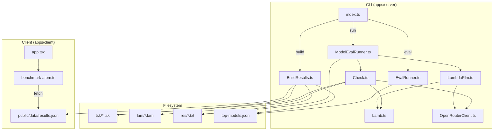
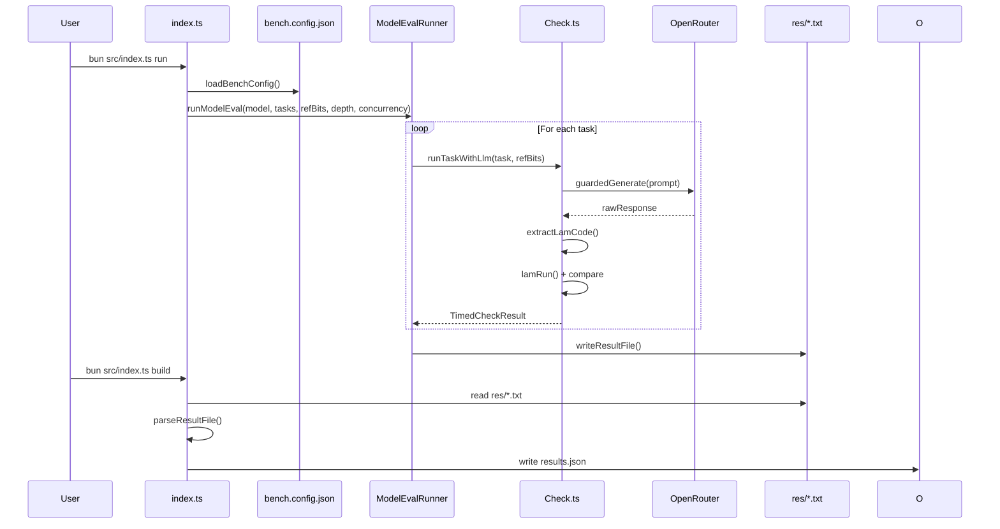
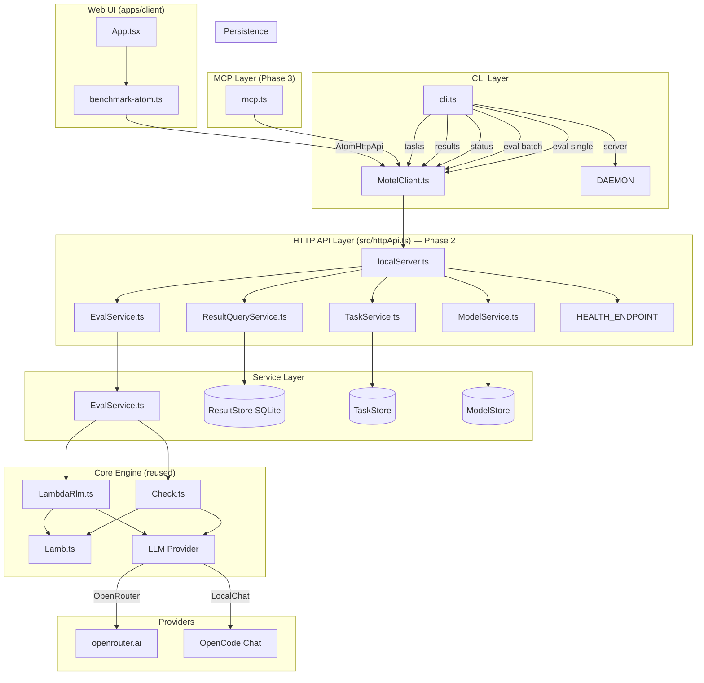
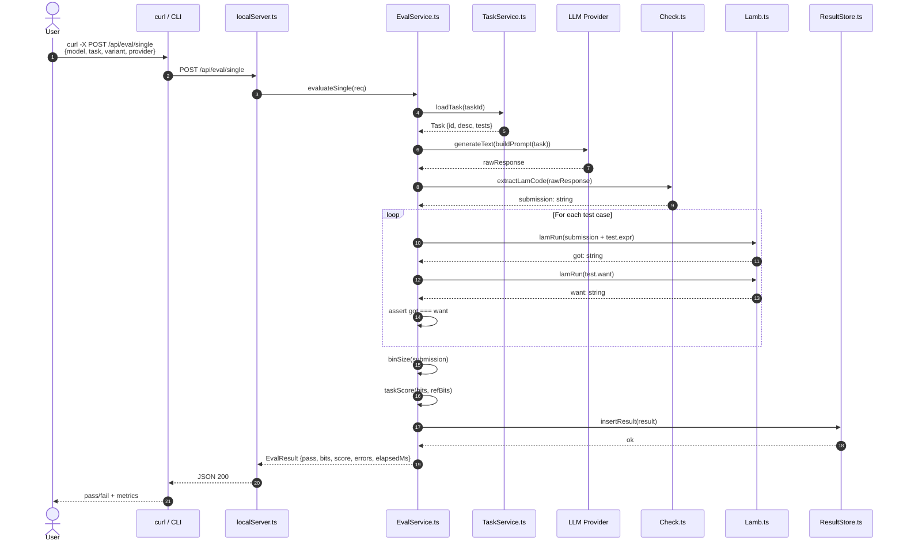
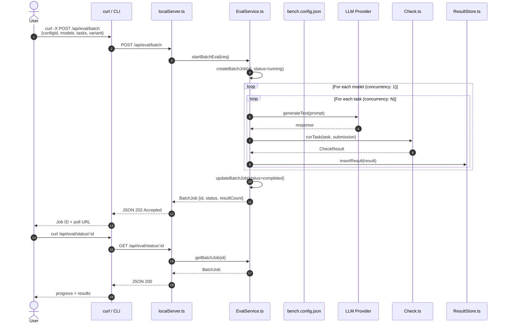
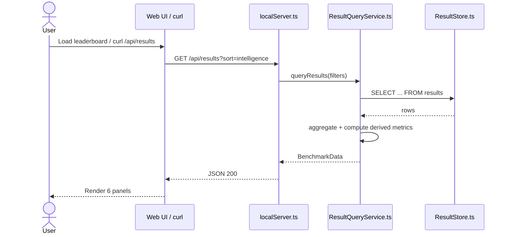

# LamBench Pro — Technical Expert Specification

> **Version:** 1.0\
> **Date:** 2026-04-28\
> **Status:** Phase 1 & 2 implemented; Phases 3–6 pending\
> **Scope:** Full architectural refactor from static-file CLI to motel-inspired local server + SQLite + HTTP API + interactive UI

---

## 1. Executive Summary

LamBench Pro evaluates AI models on pure lambda-calculus programming. The current implementation is a CLI-driven pipeline that writes `.txt` result files and aggregates them into a static `results.json` consumed by a React leaderboard UI.

This specification defines a refactor to a **local-server architecture** inspired by [`motel`](https://github.com/kitlangton/motel) (the OpenTelemetry TUI viewer). The new architecture provides:

- **Fast iteration loop** — evaluate a single model + task via `curl` and get pass/fail in ~seconds
- **Full benchmark orchestration** — config-defined models, concurrent evaluation, SQLite persistence
- **Local chat provider** — pipe evaluations through the local OpenCode LLM chat via HTTP
- **Schema-first HTTP API** — Effect `HttpApi` with auto-generated OpenAPI spec
- **Real-time web UI** — the existing Solarized leaderboard, now connected to a live local API
- **MCP server** — expose benchmark tools to AI coding agents
- **Unified Vitest + Storybook** — remove Playwright and `bun test`, standardise on Vitest everywhere

---

## 2. Current Architecture

### 2.1 High-Level Diagram



### 2.2 Evaluation Flow (Current)



### 2.3 Pain Points

| Pain Point                       | Impact                                                                            |
| -------------------------------- | --------------------------------------------------------------------------------- |
| File-based results (`res/*.txt`) | Hard to query, no history, brittle parsing                                        |
| No local server                  | Cannot iterate quickly on a single task/model                                     |
| Static client                    | Must rebuild + redeploy to see new results                                        |
| No SQLite                        | Cannot run analytics, search, or correlate runs                                   |
| Mixed test runners               | `vitest` (server), `vitest browser + playwright` (client), `bun test` (reference) |
| No MCP                           | Agents cannot introspect benchmark state programmatically                         |

---

## 3. Target Architecture

### 3.1 High-Level Diagram



### 3.2 Component Map

| Component         | Source File                                | Responsibility                                             |
| ----------------- | ------------------------------------------ | ---------------------------------------------------------- |
| **CLI**           | `apps/server/src/cli.ts`                   | Route commands (`eval`, `server`, `status`, `results`)     |
| **MCP**           | `apps/server/src/mcp.ts`                   | Model Context Protocol server exposing benchmark tools     |
| **HTTP API**      | `apps/server/src/httpApi.ts`               | Schema-first `HttpApi` definition + OpenAPI spec           |
| **Local Server**  | `apps/server/src/localServer.ts`           | Bun HTTP router, static SPA serve, API handler wiring      |
| **Eval Service**  | `apps/server/src/services/EvalService.ts`  | Orchestrate single/batch evaluation, provider dispatch     |
| **Result Store**  | `apps/server/src/services/ResultStore.ts`  | SQLite persistence for benchmark results                   |
| **Task Service**  | `apps/server/src/services/TaskService.ts`  | Load `.tsk`/`.lam` files, cache in memory                  |
| **Model Service** | `apps/server/src/services/ModelService.ts` | Manage provider configs (OpenRouter, LocalChat)            |
| **Config**        | `apps/server/src/config/LamConfig.ts`      | Env-driven + file-based config (ports, DB path, retention) |
| **Runtime**       | `apps/server/src/runtime.ts`               | Effect `ManagedRuntime` with service layers                |
| **Web UI**        | `apps/client/src/`                         | Existing React app, now powered by live API                |

---

## 4. Data Flows

### 4.1 Single Evaluation (Fast Iteration Loop)



**Latency target:** `< 5s` end-to-end for a single task with a fast model (including LLM generation, lambda normalization, and scoring).

### 4.2 Batch Evaluation (Full Benchmark)



### 4.3 Result Query Flow



---

## 5. API Specification

### 5.1 Endpoints

All routes are defined in `apps/server/src/httpApi.ts` using Effect `HttpApiGroup` and `HttpApiEndpoint`.

| Method | Path                      | Request             | Response          | Description                      |
| ------ | ------------------------- | ------------------- | ----------------- | -------------------------------- |
| `POST` | `/api/eval/single`        | `SingleEvalRequest` | `EvalResult`      | Evaluate one task with one model |
| `POST` | `/api/eval/batch`         | `BatchEvalRequest`  | `BatchJob`        | Start a full benchmark run       |
| `GET`  | `/api/eval/status/:jobId` | —                   | `BatchJob`        | Poll batch job progress          |
| `GET`  | `/api/results`            | `?sort=&filter=`    | `BenchmarkData`   | All results (leaderboard data)   |
| `GET`  | `/api/results/:runId`     | —                   | `RunResult`       | Single run detail                |
| `GET`  | `/api/tasks`              | `?category=`        | `BenchmarkTask[]` | List tasks                       |
| `GET`  | `/api/tasks/:taskId`      | —                   | `TaskDetail`      | Task + reference solution        |
| `GET`  | `/api/models`             | —                   | `ModelConfig[]`   | Configured LLM providers         |
| `POST` | `/api/models/test`        | `{provider, model}` | `{latencyMs, ok}` | Test a provider connection       |
| `GET`  | `/api/health`             | —                   | `HealthStatus`    | Server + DB health               |
| `GET`  | `/openapi.json`           | —                   | OpenAPI 3.1       | Auto-generated spec              |

### 5.2 Key Schemas (Effect Schema)

```typescript
// --- Eval ---
export const SingleEvalRequest = Schema.Struct({
  model: Schema.String, // model ID or "local"
  task: Schema.String, // task ID, e.g. "snat_add"
  variant: Schema.Literal("standard", "rlm").pipe(Schema.optionalWith({ default: () => "standard" })),
  provider: Schema.Literal("openrouter", "opencode-go").pipe(Schema.optionalWith({ default: () => "openrouter" })),
  maxTokens: Schema.Number.pipe(Schema.optionalWith({ default: () => 4096 })),
  rlmMaxDepth: Schema.Number.pipe(Schema.optionalWith({ default: () => 3 })),
  mode: Schema.Literal("direct", "agent").pipe(Schema.optionalWith({ default: () => "direct" })),
});

export const EvalResult = Schema.Struct({
  taskId: Schema.String,
  model: Schema.String,
  variant: Schema.String,
  pass: Schema.Boolean,
  bits: Schema.Number,
  score: Schema.Number,
  errors: Schema.Array(Schema.String),
  elapsedMs: Schema.Number,
  submission: Schema.String, // the .lam code returned by the model
  timestamp: Schema.String, // ISO-8601
});

export const BatchEvalRequest = Schema.Struct({
  models: Schema.Array(Schema.String),
  tasks: Schema.Array(Schema.String).pipe(Schema.optionalWith({ default: () => [] })), // empty = all
  variant: Schema.Literal("standard", "rlm", "both").pipe(Schema.optionalWith({ default: () => "both" })),
  concurrency: Schema.Number.pipe(Schema.optionalWith({ default: () => 2 })),
  mode: Schema.Literal("direct", "agent", "both").pipe(Schema.optionalWith({ default: () => "both" })),
});

export const BatchJob = Schema.Struct({
  id: Schema.String,
  status: Schema.Literal("queued", "running", "completed", "failed"),
  createdAt: Schema.String,
  completedAt: Schema.optional(Schema.String),
  totalTasks: Schema.Number,
  completedTasks: Schema.Number,
  results: Schema.Array(EvalResult), // populated when completed
});

// --- Health ---
export const HealthStatus = Schema.Struct({
  status: Schema.Literal("ok", "degraded"),
  version: Schema.String,
  db: Schema.Literal("connected", "disconnected"),
  uptimeSeconds: Schema.Number,
});
```

### 5.3 Curl Examples

```bash
# 1. Health check
curl http://localhost:9000/api/health

# 2. Evaluate a single task (fast iteration)
curl -X POST http://localhost:9000/api/eval/single \
  -H "Content-Type: application/json" \
  -d '{
    "model": "minimax/minimax-m2.5:free",
    "task": "snat_add",
    "variant": "standard",
    "provider": "openrouter"
  }'

# 3. Evaluate using the local OpenCode chat
curl -X POST http://localhost:9000/api/eval/single \
  -H "Content-Type: application/json" \
  -d '{
    "model": "local",
    "task": "snat_add",
    "variant": "standard",
    "provider": "opencode-go"
  }'

# 4. Start a full benchmark
curl -X POST http://localhost:9000/api/eval/batch \
  -H "Content-Type: application/json" \
  -d '{
    "models": ["google/gemini-2.5-pro", "minimax/minimax-m2.5:free"],
    "tasks": [],
    "variant": "both",
    "concurrency": 2
  }'

# 5. Poll batch status
curl http://localhost:9000/api/eval/status/job_abc123

# 6. Get leaderboard data
curl "http://localhost:9000/api/results?sort=intelligence"

# 7. List all tasks
curl http://localhost:9000/api/tasks

# 8. Get a specific task with its reference solution
curl http://localhost:9000/api/tasks/snat_add
```

---

## 6. Database Schema (SQLite)

### 6.1 Tables

```sql
-- Benchmark runs (a single evaluation of one model on one task)
CREATE TABLE benchmark_results (
  id INTEGER PRIMARY KEY AUTOINCREMENT,
  run_id TEXT NOT NULL,           -- grouping ID for batch runs
  job_id TEXT,                    -- references batch_jobs.id
  task_id TEXT NOT NULL,
  model TEXT NOT NULL,
  variant TEXT NOT NULL,          -- "standard" | "rlm"
  provider TEXT NOT NULL,         -- "openrouter" | "localchat"
  pass INTEGER NOT NULL,          -- 0 | 1
  bits INTEGER,
  score REAL,
  errors TEXT,                    -- JSON array of strings
  submission TEXT,                -- the .lam code
  elapsed_ms INTEGER NOT NULL,
  timestamp TEXT NOT NULL,        -- ISO-8601
  created_at DATETIME DEFAULT CURRENT_TIMESTAMP
);

-- Batch jobs
CREATE TABLE batch_jobs (
  id TEXT PRIMARY KEY,            -- uuid / nanoid
  status TEXT NOT NULL,           -- "queued" | "running" | "completed" | "failed"
  config TEXT NOT NULL,           -- JSON: {models, tasks, variant, concurrency}
  total_tasks INTEGER NOT NULL,
  completed_tasks INTEGER NOT NULL DEFAULT 0,
  created_at DATETIME DEFAULT CURRENT_TIMESTAMP,
  completed_at DATETIME
);

-- Tasks metadata (cached from .tsk files)
CREATE TABLE tasks (
  id TEXT PRIMARY KEY,
  category TEXT NOT NULL,
  category_name TEXT NOT NULL,
  description TEXT NOT NULL,
  test_count INTEGER NOT NULL,
  tests TEXT NOT NULL,            -- JSON array of {input, expected}
  ref_bits INTEGER,               -- reference solution size
  ref_solution TEXT               -- reference .lam code
);

-- Model configurations
CREATE TABLE model_configs (
  id TEXT PRIMARY KEY,            -- model ID, e.g. "openrouter/google/gemini-2.5-pro"
  provider TEXT NOT NULL,         -- "openrouter" | "localchat"
  display_name TEXT,
  price_per_m_output REAL,        -- USD per 1M tokens
  is_active INTEGER NOT NULL DEFAULT 1,
  created_at DATETIME DEFAULT CURRENT_TIMESTAMP
);

-- Indexes
CREATE INDEX idx_results_run ON benchmark_results(run_id);
CREATE INDEX idx_results_job ON benchmark_results(job_id);
CREATE INDEX idx_results_task ON benchmark_results(task_id);
CREATE INDEX idx_results_model ON benchmark_results(model);
CREATE INDEX idx_results_timestamp ON benchmark_results(timestamp);
CREATE INDEX idx_jobs_status ON batch_jobs(status);
```

### 6.2 Key Queries

```sql
-- Leaderboard: intelligence (pass rate)
SELECT
  model,
  variant,
  COUNT(*) FILTER (WHERE pass = 1) AS passed,
  COUNT(*) AS total,
  ROUND(COUNT(*) FILTER (WHERE pass = 1) * 100.0 / COUNT(*), 1) AS pct,
  AVG(elapsed_ms) FILTER (WHERE pass = 1) AS avg_time_ms
FROM benchmark_results
WHERE run_id = :run_id
GROUP BY model, variant
ORDER BY passed DESC;

-- Leaderboard: elegance (solution brevity vs reference)
SELECT
  r.model,
  AVG(1.0 - r.bits / (2.0 * t.ref_bits)) AS elegance_score
FROM benchmark_results r
JOIN tasks t ON r.task_id = t.id
WHERE r.pass = 1 AND t.ref_bits IS NOT NULL
GROUP BY r.model;

-- Task history
SELECT * FROM benchmark_results
WHERE task_id = :task_id
ORDER BY timestamp DESC
LIMIT 20;

-- Latest run per model
WITH latest AS (
  SELECT model, MAX(timestamp) AS max_ts
  FROM benchmark_results
  GROUP BY model
)
SELECT r.* FROM benchmark_results r
JOIN latest l ON r.model = l.model AND r.timestamp = l.max_ts;
```

---

## 7. UI Architecture

### 7.1 Current → Target Transition

| Aspect      | Current                                  | Target                                                    |
| ----------- | ---------------------------------------- | --------------------------------------------------------- |
| Data source | Static `results.json`                    | Live API (`/api/results`)                                 |
| State       | `useState` for tabs + `AsyncResult` atom | `AsyncResult` atom connected to `AtomHttpApi`             |
| Routing     | None (single page)                       | `react-router-dom` (optional — can remain single-page)    |
| Theme       | Solarized (CSS vars)                     | **Preserved exactly**                                     |
| Build       | Static Vite → GitHub Pages               | Vite SPA served by local server + static export for Pages |

### 7.2 Component Hierarchy (Target)

```mermaid
graph TD
    A[App.tsx] --> B[TabLine.tsx]
    A --> C[StatusLine.tsx]
    A --> D[Panels]

    D --> E[IntelligencePanel]
    D --> F[SpeedPanel]
    D --> G[ElegancePanel]
    D --> H[ValuePanel]
    D --> I[ProblemsPanel]
    D --> J[MatrixPanel]

    E --> K[BenchmarkRow.tsx]
    E --> L[BarChart.tsx]
    F --> K
    F --> L
    G --> K
    G --> L
    H --> K
    I --> M[TaskList.tsx]
    I --> N[TaskModal.tsx]
    J --> O[MatrixTable.tsx]

    A --> P[benchmark-atom.ts]
    P --> Q[AtomHttpApi.Service]
    Q --> R[/api/results]
```

### 7.3 Theme Preservation

The **Solarized palette** is a core brand asset. The refactor must preserve:

- CSS custom properties in `:root` / `.dark`
- Tailwind 4 `@theme inline` mappings
- JetBrains Mono Variable font
- Vim-style line numbers (`VimLine` component)
- Bar chart colour thresholds (`≥70% green`, `≥45% blue`, `≥20% yellow`, `<20% red`)
- No mixing of `█` and `░` glyphs

### 7.4 Responsive Design Targets (Storybook)

| Viewport | Width     | Purpose                                              |
| -------- | --------- | ---------------------------------------------------- |
| Mobile   | 375×667   | iPhone SE — stacked panels, hidden matrix            |
| Tablet   | 768×1024  | iPad — 2-column grids, condensed tabs                |
| Desktop  | 1440×900  | Standard — full 6-tab layout                         |
| Wide     | 1920×1080 | Large monitor — expanded matrix, side-by-side panels |

---

## 8. Testing Strategy

### 8.1 Test Matrix

| Layer              | Framework   | Runner                    | Environment | Coverage Target |
| ------------------ | ----------- | ------------------------- | ----------- | --------------- |
| Server unit        | Vitest      | `vitest run`              | Node (Bun)  | 80%             |
| Server integration | Vitest      | `vitest run`              | Node (Bun)  | 60%             |
| Client unit        | Vitest      | `vitest run`              | jsdom       | 70%             |
| Client visual      | Storybook   | `storybook dev` / `build` | Browser     | N/A (visual)    |
| E2E                | **Removed** | —                         | —           | —               |

### 8.2 Storybook Setup

```typescript
// .storybook/preview.tsx
import type { Preview } from "@storybook/react";

const preview: Preview = {
  parameters: {
    viewport: {
      viewports: {
        mobile: { name: "Mobile", styles: { width: "375px", height: "667px" } },
        tablet: {
          name: "Tablet",
          styles: { width: "768px", height: "1024px" },
        },
        desktop: {
          name: "Desktop",
          styles: { width: "1440px", height: "900px" },
        },
        wide: { name: "Wide", styles: { width: "1920px", height: "1080px" } },
      },
    },
    backgrounds: {
      default: "solarized-light",
      values: [
        { name: "solarized-light", value: "#fdf6e3" },
        { name: "solarized-dark", value: "#002b36" },
      ],
    },
  },
};
```

**Stories to create:**

- `App.stories.tsx` — full app shell with mock data
- `IntelligencePanel.stories.tsx` — sorted leaderboard
- `MatrixPanel.stories.tsx` — pass/fail grid
- `TaskModal.stories.tsx` — task detail overlay
- `BarChart.stories.tsx` — colour thresholds
- `VimLine.stories.tsx` — line number gutter

### 8.3 Removed Dependencies

- `@playwright/test`
- `@vitest/browser-playwright`
- `vitest-browser-react`

---

## 9. LLM Provider Architecture

### 9.1 Provider Interface

```typescript
export interface LlmProvider {
  readonly generateText: (
    prompt: string,
    options?: GenerateOptions,
  ) => Effect.Effect<string, LlmError>;
}

export class OpenRouterProvider extends Context.Tag("OpenRouterProvider")<
  OpenRouterProvider,
  LlmProvider
>() {
  static readonly layer = Layer.effect(
    OpenRouterProvider,
    Effect.gen(function* () {
      // ... create LanguageModel layer via @effect/ai-openrouter
      return OpenRouterProvider.of({ generateText: ... });
    }),
  );
}

export class LocalChatProvider extends Context.Tag("LocalChatProvider")<
  LocalChatProvider,
  LlmProvider
>() {
  static readonly layer = Layer.effect(
    LocalChatProvider,
    Effect.gen(function* () {
      // ... HTTP client to local OpenCode chat endpoint
      return LocalChatProvider.of({ generateText: ... });
    }),
  );
}
```

### 9.2 Local Chat Integration

The **LocalChat** provider enables the fast iteration loop using the OpenCode editor's built-in LLM chat. It works by:

1. The user sends a curl request to `/api/eval/single` with `"provider": "localchat"`
2. The server formats the lambda-calculus prompt
3. The server POSTs the prompt to the local OpenCode chat API (configurable endpoint, default `http://localhost:PORT/v1/chat`)
4. The user interacts with the chat in the OpenCode UI
5. The chat response is returned to the server
6. The server evaluates the `.lam` code and returns the result

This creates a **human-in-the-loop** fast iteration path: the user can iterate on the prompt or model settings via curl, watch the chat response in real-time, and get immediate pass/fail feedback.

---

## 10. Configuration

### 10.1 Environment Variables

| Variable             | Default                           | Description                      |
| -------------------- | --------------------------------- | -------------------------------- |
| `LAMBENCH_PORT`      | `9000`                            | HTTP API port                    |
| `LAMBENCH_DB_PATH`   | `.lambench-data/benchmark.sqlite` | SQLite database path             |
| `OPENROUTER_API_KEY` | —                                 | API key for OpenRouter           |
| `LLM_MODEL`          | `minimax/minimax-m2.5:free`       | Model to evaluate                |
| `RLM_MAX_DEPTH`      | `3`                               | λ-RLM self-correction iterations |
| `DEV_MODE`           | `false`                           | Skip live fetch, use mock data   |
| `EVAL_CONCURRENCY`   | `4`                               | Concurrent eval tasks            |
| `BATCH_CONCURRENCY`  | `2`                               | Concurrent batch jobs            |
| `RETENTION_DAYS`     | `90`                              | Result retention in days         |
| `MAX_DB_SIZE_MB`     | `1024`                            | Size-based retention cap         |

### 10.2 Config File (`lambench.config.json`)

```json
{
  "models": [
    {
      "id": "google/gemini-2.5-pro",
      "provider": "openrouter",
      "pricePerMOutput": 2.5
    },
    { "id": "local", "provider": "localchat", "displayName": "OpenCode Local" }
  ],
  "rlmMaxDepth": 3,
  "concurrency": 2,
  "tasks": []
}
```

---

## 11. Implementation Roadmap

### Phase 1 — Foundation (SQLite + Services)

- [ ] Create `ResultStore.ts` with SQLite schema and CRUD
- [ ] Create `TaskService.ts` (load `.tsk`/`.lam` into SQLite cache)
- [ ] Create `ModelService.ts` (provider config management)
- [ ] Create `EvalService.ts` (orchestrate single/batch eval)
- [ ] Create `LamConfig.ts` (env + file config)

### Phase 2 — HTTP API + Local Server

- [x] Define `httpApi.ts` with all endpoints
- [x] Implement `localServer.ts` (Bun HTTP router)
- [x] Implement `runtime.ts` (ManagedRuntime)
- [x] Wire services into API handlers
- [x] Add OpenAPI generation
- [x] Add empty-string `dbPath` validation to prevent silent in-memory DB
- [x] Add comprehensive integration tests (32 tests passing)

### Phase 3 — CLI + MCP

- [ ] Create `cli.ts` with commands (`eval`, `server`, `status`, `results`)
- [ ] Create `mcp.ts` with benchmark tools
- [ ] Create `MotelClient.ts` typed HTTP client

### Phase 4 — Provider Refactor

- [ ] Extract `LlmProvider` interface
- [ ] Refactor `OpenRouterClient.ts` → `OpenRouterProvider`
- [ ] Implement `LocalChatProvider`
- [ ] Update `Check.ts` and `LambdaRlm.ts` to use provider interface

### Phase 5 — Web UI Refresh

- [ ] Update `benchmark-atom.ts` to use `AtomHttpApi`
- [ ] Add API client layer in client
- [ ] Preserve Solarized theme exactly
- [ ] Ensure responsive layout works on all viewports

### Phase 6 — Testing + QA

- [ ] Migrate all `bun test` to Vitest
- [ ] Remove Playwright dependencies
- [ ] Add Storybook with viewport stories
- [ ] Add integration tests for API endpoints
- [ ] Add EvalService unit tests with mock LLM

---

## 12. Risk Assessment

| Risk                                           | Likelihood | Impact | Mitigation                                                |
| ---------------------------------------------- | ---------- | ------ | --------------------------------------------------------- |
| SQLite write-lock contention during batch eval | Medium     | High   | Use WAL mode; write results in batches; queue writes      |
| Local chat latency breaks fast iteration       | Medium     | Medium | Add timeouts; fallback to cached responses; async polling |
| Effect beta API churn                          | Medium     | Medium | Pin versions; isolate unstable imports behind adapters    |
| UI theme regression                            | Low        | High   | Storybook visual regression; pixel-diff checks            |
| Reference/lambench test migration              | Low        | Low    | Port tests mechanically; verify bit-exact outputs         |

---

## 13. Appendix: Mermaid Diagram Source

All diagrams in this document are rendered from native Mermaid syntax embedded in Markdown. They can be viewed in:

- GitHub/GitLab Markdown preview
- VS Code with Markdown Preview Mermaid Support
- Any Mermaid live editor (copy-paste)

---

_End of Specification_
